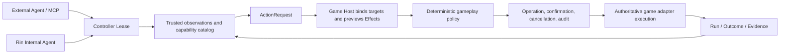

# Rin

[English](README.en.md) | [简体中文](README.md)

Rin is an engine-neutral game Agent harness. It turns low-frequency decisions
from a model or external Agent into structured actions that a game Host can
bind, authorize, execute, and audit while the game remains authoritative.

Minecraft, RPG, visual-novel, and custom-engine integrations live in adapters;
engine objects, threading models, and private APIs do not enter the Rin core.

The source version is `0.7.0` Preview. V2 is intentionally incompatible and
does not read the retired Session/Proposal protocol state. Its public contracts
are `rin.host/v2`, `rin.control/v2`, and Agent Task API `v1`.

## How it works



Core invariants:

- A model may choose capabilities, arguments, and observed targets, but it
  cannot declare ownership, risk, effects, or success.
- The Host resolves objects and produces the `BoundAction` and effect preview
  on its authority thread.
- Policy evaluates actual effects, ownership, scope, risk, and budgets and then
  allows, denies, or requires confirmation.
- `queued`, `accepted`, and `running` are not success. Completion is proven only
  by a Host outcome with `execution_confirmed=true`.
- Internal models and external MCP controllers share the same lease, policy,
  operation, and Host execution path.
- Models make low-frequency goal and action decisions. Adapters own real-time
  navigation, animation, combat, and other frame/tick control.

## Components

| Component | Responsibility |
| --- | --- |
| `host` | Observation, capability, action, effect, epoch, and adapter contracts |
| `policy` | Deterministic effect authorization, confirmation, and action budgets |
| `controlplane` | Host leases, controller leases, operation delivery, wait, cancel, and recovery |
| `cognition` | Persona, memory, skills, model decisions, and the internal Agent loop |
| `agentapi` / `agentdaemon` | Recoverable asynchronous internal Agent Task API |
| `mcpbridge` | Thin MCP 2026-07-28 proxy with no game-world ownership |
| `consoleui` / `managementapi` | Embedded local Console, long goals, shared persona, and common memory cards |
| `sdk` | Control V2 clients for Python, JavaScript, C#, Java, and Lua plus Go HostKit |

## Build locally

Building the core binaries requires Go `1.25` or newer:

```bash
make build
```

The full maintainer verification gate also requires Node.js, Python, the .NET
SDK, a JDK, and Lua:

```bash
make verify
```

The `bin/` directory then contains:

- `rin`: the unified `serve`, `console`, MCP management, Host scaffolding,
  conformance, and doctor entry point.
- `rin-control`: the resident local Control Daemon with an optional internal
  Agent Runtime.
- `rin-mcp`: the STDIO MCP proxy connected to the Control Daemon.

## Start the Control Daemon

The daemon accepts loopback addresses only and requires a random token of at
least 32 bytes. This development example grants every commonly required scope;
production deployments should narrow them.

```bash
export RIN_CONTROL_TOKEN="$(openssl rand -hex 32)"
./bin/rin serve \
  -principal local.player \
  -scopes actor.read,actor.control,actor.execute,operation.cancel,host.admin
```

Check the live contract:

```bash
curl -H "Authorization: Bearer $RIN_CONTROL_TOKEN" \
  http://127.0.0.1:7375/control/v2/info
```

Open the local management UI with:

```bash
./bin/rin console
```

The Console is served at `http://127.0.0.1:7375/console/`. It shows worlds,
actors, operations, long goals, and a readable task timeline, and it manages the
shared default persona and common memory cards. Common cards are retrievable by
internal Agents attached to the same Rin instance; game canon, actor-private
memory, and an external Agent's private memory do not become cross-game state.
The Console also manages learned skills, the internal model, optional remote
embeddings, and general gameplay policy.

## Connect external Agents

One `rin-mcp` installation can control every compatible game Host connected to
the same `rin-control` daemon. Individual games and mods do not implement their
own MCP server.

```bash
./bin/rin mcp install -agents codex,claude,openclaw
./bin/rin mcp status
./bin/rin mcp update
```

The installer manages only local Agent configuration and the `rin-mcp`
executable. Games and mods continue to use their own distribution channels.
External control uses the external Agent's persona and private memory; Rin
retains only execution authority, state, and audit data required by the harness.

## Create a game Host

The generic scaffold supports Go, JavaScript, Python, C#, Java, and Lua. It
creates a contract skeleton without downloading dependencies or pretending to
provide an engine integration.

```bash
./bin/rin init host -engine custom -runtime java -id my_game_host -output ./my-game-host
./bin/rin conformance host -path ./my-game-host
./bin/rin doctor host -path ./my-game-host
```

A complete adapter supplies trusted observations, capability discovery, target
binding, effect previews, authoritative execution, cancellation, and outcome
verification.

## Runnable examples

```bash
go test ./examples/adapters/grid ./examples/adapters/story
go run ./examples/terminal-story
```

Grid validates resources, ownership, and action rules. Story validates narrative
state changes. Terminal Story traverses the complete Control, policy, operation,
and adapter path.

## Documentation

- [Documentation index](docs/README.md)
- [Architecture](docs/architecture.md)
- [Host V2 contract](docs/host-contract.md)
- [Operations and policy](docs/operations.md)
- [Internal Agent Runtime](docs/internal-agent-runtime.md)
- [Rin Console](docs/console.md)
- [MCP and Control Plane](docs/mcp-control-plane.md)
- [Game adapter guide](docs/game-adapters.md)
- [Integration acceptance](docs/host-integration-validation.md)
- [Security policy](SECURITY.en.md)
- [Roadmap](ROADMAP.en.md)

The OpenAPI files are the sole HTTP route and field sources of truth:
`api/control-openapi.json`, `api/agent-openapi.json`,
`api/management-openapi.json`, `api/signal-openapi.json`, and
`api/task-plan-openapi.json`.

## Security boundary

Rin does not execute model-generated code, expose engine objects to models, or
allow controllers to declare effects. The built-in safety kernel denies effects
for arbitrary code, file access, native calls, authority forgery, and secret
exposure. Model and embedding provider keys must never appear in public Agent
configuration, game saves, observations, or MCP output. They may come from
environment variables or a separate mode-`0600` secret file written by the
local Console; environment variables take precedence.

See [SECURITY.en.md](SECURITY.en.md) for the threat model.

## License

[MIT](LICENSE)
