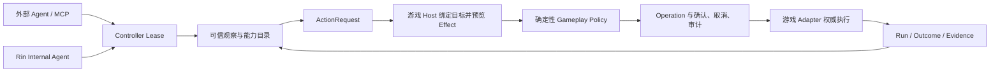

# Rin

[English](README.en.md) | [简体中文](README.md)

Rin 是一个引擎无关的游戏 Agent Harness。它把模型或外部 Agent 的低频决策，转换为
游戏 Host 可验证、可授权、可追踪的结构化行动；游戏仍然拥有世界状态和最终执行权。

Minecraft、RPG、视觉小说或自研游戏只需要实现 Adapter，不需要把游戏对象、线程模型
或私有 API 放进 Rin 核心。

当前源码版本为 `0.7.0` Preview。V2 是不兼容重构，不读取旧 Session/Proposal 协议状态。
公开契约分别为 `rin.host/v2`、`rin.control/v2` 和 Agent Task API `v1`。

## 工作方式



关键约束：

- 模型可以选择能力、参数和目标，但不能声明所有权、风险、效果或执行成功。
- Host 在权威线程解析对象、生成 `BoundAction` 和 Effect Preview。
- Policy 根据实际 Effect、资产归属、范围、风险和预算决定允许、拒绝或要求确认。
- `queued`、`accepted`、`running` 都不是成功；只有带 Host Outcome 的
  `execution_confirmed=true` 才能证明执行完成。
- 内部模型和外部 MCP 共用相同的 Lease、Policy、Operation 和 Host 执行链。
- 模型负责低频目标与行动决策；寻路、动画、战斗等实时控制由游戏 Adapter 逐帧或逐 Tick 完成。

## 主要组件

| 组件 | 职责 |
| --- | --- |
| `host` | Observation、Capability、Action、Effect、Epoch 与 Adapter 契约 |
| `policy` | 基于 Effect 的确定性授权、确认挑战和动作预算 |
| `controlplane` | Host 租约、Controller Lease、Operation 投递、等待、取消和恢复 |
| `cognition` | 人格、记忆、技能、模型决策与内部 Agent Loop |
| `agentapi` / `agentdaemon` | 可恢复的异步内部 Agent Task API |
| `mcpbridge` | MCP 2026-07-28 薄代理，不拥有游戏状态 |
| `consoleui` / `managementapi` | 嵌入式本地 Console、长目标、共享人格和公共记忆卡片 |
| `sdk` | Python、JavaScript、C#、Java、Lua 的 Control V2 客户端与 Go HostKit |

## 本地构建

构建核心二进制要求 Go `1.25` 或更高版本：

```bash
make build
```

运行完整维护者门禁还需要 Node.js、Python、.NET SDK、JDK 和 Lua：

```bash
make verify
```

产物位于 `bin/`：

- `rin`：统一入口，包含 `serve`、`console`、MCP 管理、Host 脚手架、Conformance 和 Doctor。
- `rin-control`：常驻的本地 Control Daemon，可选启用内部 Agent Runtime。
- `rin-mcp`：连接 Control Daemon 的 STDIO MCP 薄代理。

## 启动 Control Daemon

Control Daemon 只接受回环地址，并要求至少 32 字节随机 Token。以下示例授予本地开发所需
作用域；生产环境应按实际用途缩小：

```bash
export RIN_CONTROL_TOKEN="$(openssl rand -hex 32)"
./bin/rin serve \
  -principal local.player \
  -scopes actor.read,actor.control,actor.execute,operation.cancel,host.admin
```

健康与契约检查：

```bash
curl -H "Authorization: Bearer $RIN_CONTROL_TOKEN" \
  http://127.0.0.1:7375/control/v2/info
```

打开本地管理界面：

```bash
./bin/rin console
```

Console 位于 `http://127.0.0.1:7375/console/`，用于查看世界、角色、Operation、长目标与
人类可读时间线，并管理共享默认人格和公共记忆卡片。公共卡片可被所有连接到同一 Rin 的
内部 Agent 检索；游戏 Canon、角色私有记忆和外部 Agent 私有记忆不会因此跨游戏传播。
Console 还可管理 learned Skill、内部模型、可选远程 Embedding 与通用游戏权限策略。

## 接入外部 Agent

一个 `rin-mcp` 可以控制所有连接到同一 `rin-control` 的兼容游戏 Host。游戏 Mod 不需要
各自实现 MCP Server。

```bash
./bin/rin mcp install -agents codex,claude,openclaw
./bin/rin mcp status
./bin/rin mcp update
```

安装器只管理本机配置和 `rin-mcp` 可执行文件；游戏或 Mod 的发布与更新仍由各自平台负责。
外部控制时使用外部 Agent 的人格和私有记忆，Rin 只保留执行所需的权限、状态与审计信息。

## 创建游戏 Host

通用脚手架支持 Go、JavaScript、Python、C#、Java 和 Lua，并且只生成契约骨架，不下载依赖
或伪造引擎集成：

```bash
./bin/rin init host -engine custom -runtime java -id my_game_host -output ./my-game-host
./bin/rin conformance host -path ./my-game-host
./bin/rin doctor host -path ./my-game-host
```

完整 Adapter 需要实现可信观察、能力发现、目标绑定、Effect Preview、权威执行、取消和结果验证。

## 可运行示例

```bash
go test ./examples/adapters/grid ./examples/adapters/story
go run ./examples/terminal-story
```

Grid 验证资源、所有权和行动规则；Story 验证叙事状态变化；Terminal Story 走完整
Control、Policy、Operation 与 Adapter 链路。

## 文档

- [文档索引](docs/README.zh-CN.md)
- [整体架构](docs/architecture.zh-CN.md)
- [Host V2 契约](docs/host-contract.zh-CN.md)
- [Operation 与策略](docs/operations.zh-CN.md)
- [内部 Agent Runtime](docs/internal-agent-runtime.zh-CN.md)
- [Rin Console](docs/console.zh-CN.md)
- [MCP 与 Control Plane](docs/mcp-control-plane.zh-CN.md)
- [游戏 Adapter 指南](docs/game-adapters.zh-CN.md)
- [集成验收](docs/host-integration-validation.zh-CN.md)
- [安全策略](SECURITY.md)
- [路线图](ROADMAP.md)

OpenAPI 文件是 HTTP 字段与路由的唯一事实来源：
`api/control-openapi.json`、`api/agent-openapi.json`、
`api/management-openapi.json`、`api/signal-openapi.json` 和
`api/task-plan-openapi.json`。

## 安全边界

Rin 不执行模型生成的代码，不把引擎对象暴露给模型，也不允许 Controller 自行声明 Effect。
任意代码、文件访问、原生调用、权限伪造和秘密泄露 Effect 会被内置安全内核拒绝。API Key
不能写入 Agent 配置、游戏存档、观察数据或 MCP 输出；它只能来自进程环境，或由本机
Console 写入权限为 `0600` 的独立 secret 文件，且环境变量始终优先。

详细威胁模型见 [SECURITY.md](SECURITY.md)。

## License

[MIT](LICENSE)
