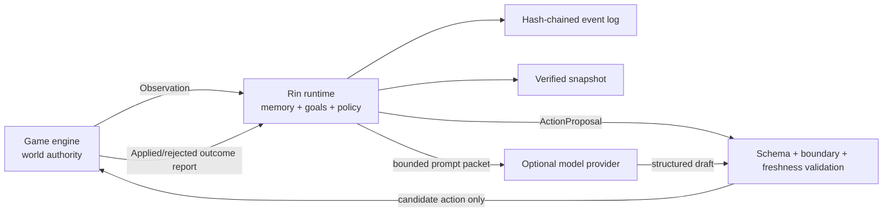

# Architecture

[English](architecture.md) | [简体中文](architecture.zh-CN.md)

Rin is an engine-neutral control plane for agent state and decisions, not the
authority that simulates or mutates the game world.

## Authority boundary



The game engine always owns world authority. Rin never directly changes
scenes, quests, items, combat, character positions, critical choices, or
saves. A policy may choose only from the current request's
`candidate_actions`; the runtime also verifies actor, goal, memory references,
boundaries, session revision, and content binding.

## Components

### Protocol

`protocol` is the only layer other languages need to reproduce. Every request
explicitly carries `rin.protocol/v1`. The HTTP layer rejects unknown JSON
fields, and identifiers cannot contain path separators.

### Runtime

`runtime.Engine` is a deterministic state machine. Each session has its own
lock. Policy execution happens outside that lock, so a slow remote model does
not block new observations or state reads. Legacy sessions use revision and
head hash to detect stale Proposals before application. Sessions opting into
`outcome-reporting-v1` use the game-authoritative apply-then-report lifecycle
and occurrence-time merge described below. Sessions with
`arbitration-v1` use a `world_revision` that advances with authoritative
Observations and settled Outcomes, allowing several actors to propose in
parallel during one turn. Once the game has handled an Outcome, Rin records it
even when the report arrives after state has advanced.

Detailed memory keeps a fixed window. `memory-archive-v1` deterministically
selects a low-salience batch from the older half, then records a bounded,
lossy Summary with a tick range and representative source IDs. Hierarchical
text reserves an oldest head anchor, gives additional budget to important and
more recent fragments, and reserves the newest tail; source sampling retains
the oldest and newest known IDs and distributes the remaining slots over the
represented tick range. High importance increases retention budget but is not
a promise that text survives every future merge.

When the 32-Summary cap is crossed, Runtime continues to merge the oldest four
direct Summary lineages. That membership and Summary-ID derivation stay
stable because an older `proposal.created` event may persist one of those IDs
in `recalled_memory_ids`. `belief-conflicts-v1` keeps up to eight sourced
claims per actor while retaining the legacy `beliefs` field as the currently
selected projection. Both features are reconstructed entirely by event replay
and require no vector database.

Memory compaction is cognitive forgetting only: it does not delete or redact
the authoritative event log, erase permanent Identifier History, or provide a
privacy-erasure mechanism. Replay, checkpoints, backups, and retained
Snapshots can still contain text no longer present in bounded cognition State.

Durable request identity is deliberately separate from those bounded cognition
projections. Each managed Session retains an `identifier-history-v1` ledger
whose request entries bind a mutation kind and canonical typed-request digest
to its original result, while event entries tombstone every accepted Observe
or Outcome Event ID. `SessionState.Receipts` remains a 1,024-entry hot
projection for compatibility and diagnostics; evicting it never removes
Identifier History.

The request digest is SHA-256 over canonical JSON produced after strict typed
decoding. Exact retries therefore ignore object member order and whitespace but
must match every typed field and array order. A duplicate returns the original
Mutation revision/head or typed Proposal/Arbitration with `duplicate=true`.
Those coordinates identify the first operation rather than the current live
head.

### Policy

The policy interface returns only a `ProposalDraft`. The runtime does not
trust its implementation: actions must come from the allowlist, memory and
goal IDs must exist, stance must be valid, and a triggered actor boundary must
select its game-authored response. `ProposalDraft.Summary` and
`ProposalDraft.Rationale` remain only for Go source compatibility and are
never published.

The runtime is the single player-text information-flow gate. It always
rebuilds `ActionProposal.summary` from the selected game-authored
`ActionSpec.description` and `ActionProposal.rationale` from a fixed
stance template. Goal, boundary, memory, belief, prompt, and provider text are
not inputs to that function. This is a construction rule, not a secret-string
blacklist. `goal_id`, `boundary_id`, `recalled_memory_ids`, and
`policy_source`, plus the full `proposed_goal`, retain private structured
audit/integration data and must not be rendered directly in a player UI.
Except for its explicitly display-authorized `description`, an action's ID,
kind, targets, and parameters are also integration data unless the game
separately authorizes them for display.

Reducer projection `rin.reducer-projection/v2` applies the same reconstruction
to legacy `proposal.created` events, imported Snapshots, retained recent
actions, checkpoints, and durable exact-retry results. This changes only the
derived presentation projection: authoritative event bytes, event hashes,
request/result coordinates, actions, and audit IDs remain unchanged. An exact
retry of a pre-v2 Proposal can therefore return upgraded `summary` and
`rationale` while preserving its original revision and head. Raw event and
Restore payloads may still contain the old private strings and are not erased
by upgrading.

The built-in `policy.Deterministic` is the offline baseline:

1. If tags trigger a boundary, choose only its matching `refuse`, `redirect`,
   or `wait` action.
2. Otherwise, prefer the highest-priority active goal.
3. Select up to three memories by importance, recency, tags, and recall count.
4. Penalize repeated actions and break ties deterministically from a fixed
   seed and request context.

The online model policy replaces only steps 2 through 4. It never bypasses the
runtime validator.

### Model policy

The model policy builds a minimal context packet. System instructions and
game data are separate messages. Player input, story text, and content-pack
fields all live under `untrusted_game_data`; a separate `contract` lists the
only legal action, memory, and goal IDs. Even when a provider does not support
strict JSON Schema, the result still receives local unknown-field, type,
and ID-allowlist validation. The output schema has no `summary` or `rationale`
property; returning either is an unknown-field failure. The prompt explicitly
forbids copying private decision text, and the runtime player-text gate remains
authoritative even for custom policies or non-conforming providers.

Character boundaries are handled locally before calling a provider. A
triggered boundary uses `boundary-guard` directly instead of relying on the
model to refuse.

### Provider resilience

The OpenAI-compatible client uses only the standard library. Each call has an
attempt timeout and total timeout. Only temporary failures such as network
errors, 429, 408, and 5xx responses are retried. Repeated failures open a
circuit breaker; while open, calls immediately enter offline fallback.
Response bodies, prompts, and keys are never written to errors, logs, or
state. Attempt and total deadlines rely on the `provider.Client` cooperative
cancellation contract: an implementation must observe `ctx.Done()` and return
promptly. Go cannot forcibly preempt a third-party client that blocks forever.

Model drafts use a bounded in-memory cache keyed by session head hash, actor,
and semantic request. Concurrent calls with the same key collapse into one
provider request. Once state changes, the head hash changes and an old result
cannot match the new world state.

### Async jobs

`jobs.Manager` uses bounded workers and a bounded queue. A game first submits
`/v1/jobs/propose`, continues rendering and accepting input, then polls with
GET. If the session changes while an actor is thinking, the job ends as
`stale` and no obsolete proposal is written. Cancellation propagates through
context to the HTTP provider.

Job metadata remains in process memory and may expire after its retention TTL.
A successful Proposal is already in the event log. After Job eviction or a
sidecar restart, a client may resubmit the exact request; the Engine's durable
Session identity ledger returns the original Proposal even though the
process-local Job record is reconstructed. Job timestamps and intermediate
status are not durable.

### Structured generation

`generation.Manager` provides another bounded asynchronous queue for
game-owned constrained prompts. It reuses the resilient provider but does not
read Session State or write to the event log. Same-request deduplication lasts
only while the process-local Job record is retained; semantic content after
removing the request ID is cached briefly. After eviction or restart, an exact
request may invoke the provider again. Cancellation propagates to the provider.

Generation guarantees only transport, size, and a valid top-level JSON
object. Each game must still validate its own `ScenePacket`, quest, dialogue,
or ending schema. If validation fails, the game discards the result and uses
local content. Model output never becomes canon automatically.

### Game adapters

Ren'Py, Godot, and Unity adapters translate JSON/HTTP and engine-specific
asynchrony without copying the runtime state machine. Online results have
`committable=true`, meaning the game may report that Proposal ID after handling
it, not that Rin authorizes execution. An adapter may choose an authored
fallback from the current candidate list only when it knows submission never
created an online Proposal (for example, the sidecar was disabled or the
initial connection was refused), and marks it `committable=false`. A submit,
poll, timeout, or cancellation with an unconfirmed outcome fails closed; the
game must not send a local `offline.*` ID to `/commit`.

The Ren'Py worker registry, Godot `HTTPRequest`, and Unity coroutines exist
only in process memory. A game save stores snapshots and plain results, never
threads, futures, sockets, HTTP objects, or API tokens.

### Multi-actor coordination

The game supplies the upper bound and semantic scope of candidate goals. A
policy may only recommend adopting one; the game applies it and reports an
accepted Commit before Rin writes the goal into an actor. The game's region or
simulation system updates activity state. Dormant actors never wake
themselves. Arbitration stably sorts proposals at the same world revision and
records conflicts, but it does not execute actions. With
`outcome-reporting-v1`, the game may adjust or reject them and then report
actual outcomes through an atomic Batch Commit.
See [action outcome reporting](outcome-reporting.md) for the full transaction
and Outbox rules.

This lets Rin support visual novels, RPG NPCs, and simulation residents
without taking responsibility for pathfinding, collision, quest rules, or a
scene tree.

### Observability

Timeline extracts only IDs and enum states from event payloads. It does not
return the player's original words, story summaries, commit outcomes, or
model content. On the bundled file store, Timeline reads a bounded revision
range and does not rerun the reducer over the complete log for every page.
Replay uses the newest usable checkpoint at or before the selected revision,
then runs the normal reducer over the remaining tail and produces a complete,
verifiable Snapshot without writing an exported Snapshot to the store.
Once the Session is loaded, Timeline and Replay capture their live-session
boundary under the Session lock, then perform range I/O and replay after
releasing that mutation lock. A first lazy load remains serialized.
`rin inspect` reuses both paths for machine-readable diagnostics. With a
healthy revision index it locates the requested trailing Timeline window
directly, instead of paging forward from genesis merely to retain the last
entries.

Replay State is revision-specific, but its Snapshot carries the complete
local-lineage Identifier History, including tombstones created after the
selected State revision. Otherwise, restoring an old Replay result would make
later IDs reusable. Identifier result revisions can consequently exceed the
replayed State revision.

Opening an Engine is intentionally lazy: it enumerates Session IDs but does
not read every Session history. The first operation on a Session verifies and
loads that Session through the checkpoint-and-tail recovery path.
After successful recovery, Runtime best-effort asynchronously queues a
checkpoint at the recovered head when no usable checkpoint was selected, or
when `head revision / selected checkpoint revision >= 2`. The checkpoint may
not be durable when the read returns. This derived cache write is not part of
read success and its failure is ignored; the [Store](#store) section describes
the bounded worker and concurrency contract.
`Engine.VerifyAll()` is the explicit maintenance operation for a
checkpoint-independent, genesis-to-head replay and hash-chain audit of every
Session. Ordinary `rin inspect` reads only its requested Session and does not
implicitly perform that data-directory-wide audit.

### Mutation and state closure

Every event is first applied to an isolated candidate state. The reducer then
validates the complete `SessionState`, including feature-gated fields,
capacities, revision and tick bounds, actor references, and paired belief
projections. Only a valid candidate may be appended to the Store and published
as the live state. A reducer or candidate-validation failure therefore leaves
both the event log and the in-memory session unchanged. Store write failures
use the separate append-confirmation and reconciliation rules described by the
outcome protocol.

The same durability boundary applies to Identifier History. A successful
append publishes State and its request/Event ID entries together. A failed or
uncertain append cannot expose a tombstone without its event or expose an event
without its tombstone; reconciliation derives both from the confirmed durable
tail.

When a Store error leaves append durability unknown, the Engine does not
publish the candidate State or Identifier History. It retains an uncertainty
barrier for the exact logical event: only the same mutation kind and canonical
typed-request digest may attempt confirmation, while every other Session
mutation fails closed behind it. Non-Proposal operations surface
`mutation_outcome_unknown`; Proposal keeps `proposal_outcome_unknown` for wire
compatibility. A successful exact retry reconciles the confirmed durable tail
and publishes State plus Identifier History once. Create and fresh Restore use
the same rule before registering the Session in memory.

Policy calls receive isolated copies of the State, Actor, and request. Policy
code may inspect or mutate those values locally, but it cannot mutate the live
session outside an event. Runtime-owned collections also close their
references when bounded retention runs: memory compaction rewrites recalled
IDs to the replacement Summary, non-archive eviction removes those references,
and Belief/BeliefSet eviction is deterministic and paired.

### Store

All Store operations for one Session must be linearizable,
and `Load` must be read-after-write consistent with `Create` and `Append`.
The Engine treats
`ErrNotFound` immediately after a failed Create as proof that no first event
was written, and an unchanged authoritative tail immediately after a failed
Append as proof that the candidate event was not written. A custom Store that
cannot make either observation authoritative must return an uncertainty error
from `Load`, never stale data; eventually consistent implementations do not
satisfy the runtime Store contract.

File-store layout:

```text
rin-data/
├── .rin.lock
└── sessions/
    └── session.id/
        ├── events.jsonl
        ├── events.idx
        ├── checkpoint-<revision>-<hash>.json
        └── snapshot-<revision>-<hash>.json
```

An event hash covers sequence, type, request ID, recorded time, previous event
hash, and payload. `events.jsonl` is the authority and uses
`retain_forever`: Rin does not automatically delete or compact events because
Replay, permanent request/Event ID identity, and audit depend on the lineage.
Operators must plan capacity, backup, and archival around that policy rather
than deleting an active log behind Rin.

`events.idx` is a derived revision/offset/hash index used for head and bounded
range reads. A missing, stale, or malformed index is rebuilt atomically from
`events.jsonl`; the rebuild performs one complete log scan. A healthy index is
cached after first access, so later Timeline pages do not repeatedly scan or
materialize the complete event log. Deleting the index is safe, but the next
access pays the rebuild cost.

The base `Store` API remains source-compatible. Optional `RangeStore` supplies
`Head` and bounded `LoadRange`; optional `CheckpointStore` supplies
`LoadCheckpoint` and `SaveCheckpoint`. Checkpoint acceleration requires the
same Store to implement both interfaces, because Runtime uses `RangeStore` to
validate each checkpoint's event-chain anchor. An internal checkpoint uses
`CheckpointFormatVersion = "rin.checkpoint/v1"` and
`ReducerProjectionVersion = "rin.reducer-projection/v2"`. Projection v2
introduces fair bounded-memory text/source sampling and canonical,
game-authored Proposal presentation. Summary lineage IDs remain compatible
with v1 so persisted recalled references still replay. A v1 checkpoint is
obsolete and falls back to an older compatible candidate or genesis; the
authoritative event log is unchanged. A checkpoint is a derived cache, not a
public Snapshot, backup, or source of authority, and carries the
Session/revision/head anchor, lineage epoch, complete State and Identifier
History projection, and a checksum. Before use, Runtime validates that wrapper,
the projection version and checksum, the enclosed Snapshot, and the matching
event-chain anchor. A missing, corrupt, obsolete, or mismatched checkpoint is
skipped in favor of an older candidate or genesis replay. The checksum detects
accidental corruption; it is not authentication or provenance proof.
Checkpoint write failure never reverses an already durable mutation or fails a
successfully recovered read.

Runtime queues a revision-1 checkpoint after Session creation (including a
fresh Session created by Restore), then automatically queues checkpoints only
at power-of-two revisions at or above 256. It does not checkpoint every
multiple of 256 or every later Restore. Successful lazy recovery queues a
repair when no usable checkpoint exists, or when
`head revision / selected checkpoint revision >= 2`; a small valid tail does
not cause an exact-head rewrite on every restart.

Checkpoint construction and persistence are best-effort asynchronous work.
While holding the Session mutation lock, Runtime captures the immutable
published State reference and shallow-copies the two Identifier History maps;
ledger entries are immutable after insertion. Full cloning, validation,
hashing, and `SaveCheckpoint` I/O run outside that lock. Within one Engine,
each managed Session has at most one worker and one latest pending capture, so
crossing several thresholds while a save is active coalesces to the newest
pending revision. Multiple Engines sharing a Store can each have such a
worker. A mutation or successful lazy read does not wait for the derived
checkpoint to finish, and the checkpoint might therefore not be visible
immediately when the call returns.

`SaveCheckpoint` may run concurrently with `Append`, `Load`, `Head`, or
`LoadRange` for the same Session. A CheckpointStore must be concurrency-safe
and isolate expensive derived-artifact work from synchronization needed by
authoritative event operations. Runtime does not expose a Close/drain
operation: a Store that blocks `SaveCheckpoint` forever can strand the one
bounded worker for that managed Session in that Engine, though it must not
change the durable mutation result. The file store keeps the two newest valid
checkpoint files per Session. Checkpoints deliberately do not use the public
16 MiB inline Snapshot ceiling, because they never cross the Snapshot JSON API
boundary. They remain sensitive event-log-level state.

Public Snapshot files are named by revision and State hash, but their contents
are not immutable by path. The file store atomically replaces the same path to
repair a damaged artifact or persist the same State revision/hash with newer
Identifier History. Consumers must validate `identifier_history_hash` and must
not treat the filename as the complete Snapshot identity. The file store keeps
the two newest valid Snapshot files per Session. This retention applies only
to those local files; it neither truncates Identifier History nor changes the
16 MiB inline Snapshot/Replay/Restore contract.

Snapshot `state_hash` covers bounded State. `identifier_history_hash`
independently covers canonical `identifier_history`, including its
`identifier-history-v1` version and `coverage_complete` marker. History retains
original Proposal/Arbitration results, so it grows linearly with mutations and
may re-expose text already evicted from cognition State. Snapshot files and
bodies require the same confidentiality and integrity controls as the full
event log. These SHA-256 values are canonical checksums: they detect accidental
damage or an edit that did not update the checksum, but they are not signatures
or provenance proof and cannot stop an editor who can recompute them. A
Snapshot is trusted, opaque serialized state, not an untrusted import format.

The file store obtains a non-blocking exclusive lease on `.rin.lock` before
opening the data directory. A second process fails to open the same directory;
the lease remains held until `(*store.File).Close`, which is idempotent and
waits for in-flight Store calls. Embedded users must therefore always call
`Close`; the `rin serve` and `rin inspect` commands do so automatically.
The bundled `flock` implementation currently supports only `darwin` and
`linux`. On every other GOOS, `store.OpenFile` returns
`ErrDataDirectoryLockUnsupported` and fails closed instead of returning a
usable File Store without the single-writer guarantee. Multi-instance
deployments must implement an externally coordinated Store instead of sharing
a JSONL directory.

The bundled file store is supported only on a local filesystem where `flock`,
same-directory atomic rename, file `fsync`, and directory `fsync` have reliable
local semantics. NFS, SMB, FUSE mounts, and cloud-synchronized directories are
unsupported even for one Rin process. Put an externally coordinated Store in
front of remote or shared storage instead of pointing the JSONL store at it.

File creation and append sync `events.jsonl`; the corresponding index write
is synced separately. New Session directories are renamed into place and
their parent directory is synced. Snapshot, checkpoint, and rebuilt-index
publication uses a `0600` temporary file, file `fsync`, rename, and directory
`fsync`; retention deletion is followed by another directory `fsync`. A crash
after a durable event but before its index update leaves a stale derived index
that is rebuilt from the log. These are local-filesystem crash-consistency
measures, not a guarantee against storage hardware, kernel, filesystem,
backup, or operator failures.

Lazy loading changes where cost is paid; it does not make unbounded lineage
free. Engine Open is proportional to Session-directory enumeration rather
than every log body. A Session's first access must read its index and complete
Identifier History; a missing or unusable index triggers an
`O(total events)` log scan. With a usable checkpoint, state reconstruction
then scales with the checkpoint body plus its event tail. Steady-state
Timeline pagination scales with the requested range, while Replay scales with
the selected checkpoint tail and with the complete Identifier History carried
in its result. `Engine.VerifyAll()` intentionally remains
`O(total event-log bytes)` for an independent full audit.

Legacy entries whose full request digest cannot be recovered, or whose ID was
historically reused, become ambiguous tombstones: the old log remains
readable, but a later request cannot safely reuse that ID.

## NPC scheduling

Each actor declares `think_every_ticks`. After the game applies an action and
reports an accepted Commit,
`next_think_tick = max(current, commit.tick + think_every_ticks)`, so a late
report cannot move scheduling backward. A game may call
`/v1/scheduler/due` when entering a region, ending a turn, advancing time, or
handling a critical event. It should never poll a model from render frames.

An urgent event may set `urgent: true` on a propose request. Urgency bypasses
only scheduling time, never boundaries or the action allowlist.

## Save and rollback

- Game saves should store snapshots returned by Rin, not internal file paths.
- A snapshot carries the content-pack binding and state hash. Rin validates a
  cloned State before hashing or saving it, so every successfully returned
  snapshot passes the same structural validation used by Restore.
- Restore requires `expected_binding` from the running game's trusted content
  manifest; callers must not derive it from the imported Snapshot. It must
  match `snapshot.state.binding`. For an existing target Session, that Session
  is the third participant and its binding must also match; a fresh target is
  initialized only after the first two match.
- A new Snapshot also carries `identifier_history` and
  `identifier_history_hash`. The history is outside bounded State and retains
  permanent request/Event ID tombstones plus original operation results.
- A legacy Snapshot without history remains readable, but its coverage is
  permanently incomplete: only IDs still discoverable from its bounded State
  can be seeded. `coverage_complete=false` is sticky across all later Snapshot
  and Restore merges.
- With `outcome-reporting-v1`, Restore retains pending proposals so a saved,
  unhandled Proposal Attempt can resume, and so a game-save Outcome Outbox can
  report actions already applied before the save. Restored proposals never
  authorize execution; the game must use its persisted Attempt and
  applied-operation marker to distinguish the states, revalidate any action
  that was not already handled, and never repeat one that was.
- Sessions without that Feature retain legacy Restore behavior and clear
  proposals.
- Committed events, memories, facts, goal progress, and scheduling ticks are
  restored.
- Restore starts a new local event-chain generation. Retained Proposal,
  Memory, Belief, Activity, and Arbitration revision metadata is rebased to
  that generation before the restored State is published. Imported historical
  Receipt revisions are set to zero; the new Restore Receipt records the local
  generation.
- Restore unions the current and imported Identifier Histories. IDs from an
  abandoned future branch remain tombstoned; incompatible verified mappings
  reject Restore instead of being overwritten.
- A duplicate result imported from another generation retains the original
  operation revision/head. Those coordinates may not be replayable in the new
  local chain and must not be treated as its current head.
- A new data directory may import a snapshot; its local event chain then
  begins with a restore event.
- When loading the same save repeatedly, callers should bind the restore
  request ID to both the saved snapshot hash and current sidecar head. This
  distinguishes a network retry from a real second rollback.
- Identifier History grows with the lineage. Complete compact inline Snapshot
  JSON is capped at 16 MiB and is never truncated; Snapshot, Replay, or Restore
  returns `413 snapshot_too_large` when that ceiling is exceeded. The server's
  default request-body limit and every bundled client's default response limit
  are 32 MiB, leaving envelope, Restore, and EventRecord headroom. Such a
  lineage cannot use the current JSON Snapshot, Replay, or Restore endpoints;
  no streaming Snapshot transport is currently provided.

## Model integration rule

Implement model access as another `Policy`, or let a higher-level showrunner
produce a structured draft first. Provider requests must have timeouts and
cancellation. Read API keys only from the process environment or secure host
storage. Models receive no event files, snapshot paths, game scripts, or
arbitrary tool execution.
