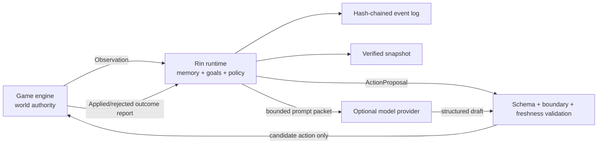

# Architecture

[English](architecture.md) | [简体中文](architecture.zh-CN.md)

Rin is an engine-neutral control plane for agent state and decisions, not the
authority that simulates or mutates the game world.

## Authority boundary



The game engine always owns world authority. Rin never directly changes
scenes, quests, items, combat, character positions, critical choices, or
saves. A policy may choose only from the current request's
`candidate_actions`; the runtime also verifies actor, goal, memory references,
boundaries, session revision, and content binding.

## Components

### Protocol

`protocol` is the only layer other languages need to reproduce. Every request
explicitly carries `rin.protocol/v1`. The HTTP layer rejects unknown JSON
fields, and identifiers cannot contain path separators.

### Runtime

`runtime.Engine` is a deterministic state machine. Each session has its own
lock. Policy execution happens outside that lock, so a slow remote model does
not block new observations or state reads. Legacy sessions use revision and
head hash to detect stale Proposals before application. Sessions opting into
`outcome-reporting-v1` use the game-authoritative apply-then-report lifecycle
and occurrence-time merge described below. Sessions with
`arbitration-v1` use a `world_revision` that advances with authoritative
Observations and settled Outcomes, allowing several actors to propose in
parallel during one turn. Once the game has handled an Outcome, Rin records it
even when the report arrives after state has advanced.

Detailed memory keeps a fixed window. `memory-archive-v1` compresses the
oldest batch into a deterministic summary with source IDs, tick range, and
reason, then continues hierarchical merging when summaries reach their cap.
`belief-conflicts-v1` keeps up to eight sourced claims per actor while
retaining the legacy `beliefs` field as the currently selected projection.
Both are reconstructed entirely by event replay and require no vector
database.

### Policy

The policy interface returns only a `ProposalDraft`. The runtime does not
trust its implementation: actions must come from the allowlist, memory and
goal IDs must exist, and text length and stance must be valid.

The built-in `policy.Deterministic` is the offline baseline:

1. If tags trigger a boundary, choose only its matching `refuse`, `redirect`,
   or `wait` action.
2. Otherwise, prefer the highest-priority active goal.
3. Select up to three memories by importance, recency, tags, and recall count.
4. Penalize repeated actions and break ties deterministically from a fixed
   seed and request context.

The online model policy replaces only steps 2 through 4. It never bypasses the
runtime validator.

### Model policy

The model policy builds a minimal context packet. System instructions and
game data are separate messages. Player input, story text, and content-pack
fields all live under `untrusted_game_data`; a separate `contract` lists the
only legal action, memory, and goal IDs. Even when a provider does not support
strict JSON Schema, the result still receives local unknown-field, type,
length, and ID-allowlist validation.

Character boundaries are handled locally before calling a provider. A
triggered boundary uses `boundary-guard` directly instead of relying on the
model to refuse.

### Provider resilience

The OpenAI-compatible client uses only the standard library. Each call has an
attempt timeout and total timeout. Only temporary failures such as network
errors, 429, 408, and 5xx responses are retried. Repeated failures open a
circuit breaker; while open, calls immediately enter offline fallback.
Response bodies, prompts, and keys are never written to errors, logs, or
state.

Model drafts use a bounded in-memory cache keyed by session head hash, actor,
and semantic request. Concurrent calls with the same key collapse into one
provider request. Once state changes, the head hash changes and an old result
cannot match the new world state.

### Async jobs

`jobs.Manager` uses bounded workers and a bounded queue. A game first submits
`/v1/jobs/propose`, continues rendering and accepting input, then polls with
GET. If the session changes while an actor is thinking, the job ends as
`stale` and no obsolete proposal is written. Cancellation propagates through
context to the HTTP provider.

Job metadata remains in process memory. A successful proposal is already in
the event log. After a sidecar restart, a client may resubmit the same
`request_id`; the engine idempotently returns the proposal it already
generated.

### Structured generation

`generation.Manager` provides another bounded asynchronous queue for
game-owned constrained prompts. It reuses the resilient provider but does not
read session state or write directly to the event log. Requests are
idempotent over the complete payload and briefly cached by semantic content
after removing the request ID. Cancellation propagates to the provider.

Generation guarantees only transport, size, and a valid top-level JSON
object. Each game must still validate its own `ScenePacket`, quest, dialogue,
or ending schema. If validation fails, the game discards the result and uses
local content. Model output never becomes canon automatically.

### Game adapters

Ren'Py, Godot, and Unity adapters translate JSON/HTTP and engine-specific
asynchrony without copying the runtime state machine. Online results have
`committable=true`, meaning the game may report that Proposal ID after handling
it, not that Rin authorizes execution. An adapter may choose an authored
fallback from the current candidate list only when it knows submission never
created an online Proposal (for example, the sidecar was disabled or the
initial connection was refused), and marks it `committable=false`. A submit,
poll, timeout, or cancellation with an unconfirmed outcome fails closed; the
game must not send a local `offline.*` ID to `/commit`.

The Ren'Py worker registry, Godot `HTTPRequest`, and Unity coroutines exist
only in process memory. A game save stores snapshots and plain results, never
threads, futures, sockets, HTTP objects, or API tokens.

### Multi-actor coordination

The game supplies the upper bound and semantic scope of candidate goals. A
policy may only recommend adopting one; the game applies it and reports an
accepted Commit before Rin writes the goal into an actor. The game's region or
simulation system updates activity state. Dormant actors never wake
themselves. Arbitration stably sorts proposals at the same world revision and
records conflicts, but it does not execute actions. With
`outcome-reporting-v1`, the game may adjust or reject them and then report
actual outcomes through an atomic Batch Commit.
See [action outcome reporting](outcome-reporting.md) for the full transaction
and Outbox rules.

This lets Rin support visual novels, RPG NPCs, and simulation residents
without taking responsibility for pathfinding, collision, quest rules, or a
scene tree.

### Observability

Timeline extracts only IDs and enum states from event payloads. It does not
return the player's original words, story summaries, commit outcomes, or
model content. Replay runs the same reducer to a selected revision and
produces a complete, verifiable snapshot without writing to the store.
`rin inspect` reuses both paths for machine-readable diagnostics; opening a
data directory still verifies the entire event hash chain.

### Store

File-store layout:

```text
rin-data/
└── sessions/
    └── session.id/
        ├── events.jsonl
        └── snapshot-<revision>-<hash>.json
```

An event hash covers sequence, type, request ID, recorded time, previous event
hash, and payload. Startup fully replays and verifies the chain. A broken
link, rewritten record, or unknown event type prevents session loading.
Snapshots are immutable files named by revision and hash, written through a
temporary file in the same directory, `fsync`, and rename with `0600`
permissions. This avoids relying on platform-specific overwrite-rename
behavior.

The file store is single-writer. Only one Rin process may use a data directory
at a time. Multi-instance deployments should implement an externally
coordinated store instead of sharing a JSONL directory.

## NPC scheduling

Each actor declares `think_every_ticks`. After the game applies an action and
reports an accepted Commit,
`next_think_tick = max(current, commit.tick + think_every_ticks)`, so a late
report cannot move scheduling backward. A game may call
`/v1/scheduler/due` when entering a region, ending a turn, advancing time, or
handling a critical event. It should never poll a model from render frames.

An urgent event may set `urgent: true` on a propose request. Urgency bypasses
only scheduling time, never boundaries or the action allowlist.

## Save and rollback

- Game saves should store snapshots returned by Rin, not internal file paths.
- A snapshot carries the content-pack binding and state hash.
- With `outcome-reporting-v1`, Restore retains pending proposals so a saved,
  unhandled Proposal Attempt can resume, and so a game-save Outcome Outbox can
  report actions already applied before the save. Restored proposals never
  authorize execution; the game must use its persisted Attempt and
  applied-operation marker to distinguish the states, revalidate any action
  that was not already handled, and never repeat one that was.
- Sessions without that Feature retain legacy Restore behavior and clear
  proposals.
- Committed events, memories, facts, goal progress, and scheduling ticks are
  restored.
- A new data directory may import a snapshot; its local event chain then
  begins with a restore event.
- When loading the same save repeatedly, callers should bind the restore
  request ID to both the saved snapshot hash and current sidecar head. This
  distinguishes a network retry from a real second rollback.

## Model integration rule

Implement model access as another `Policy`, or let a higher-level showrunner
produce a structured draft first. Provider requests must have timeouts and
cancellation. Read API keys only from the process environment or secure host
storage. Models receive no event files, snapshot paths, game scripts, or
arbitrary tool execution.
