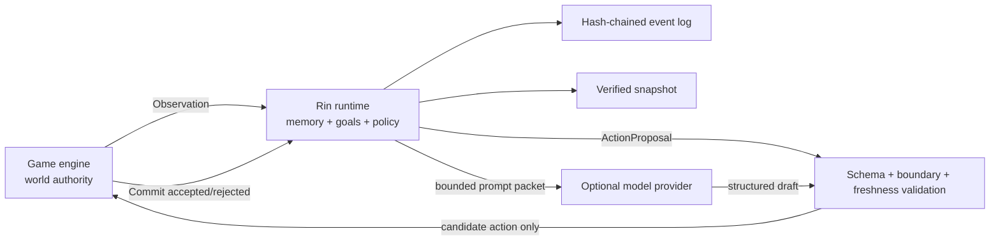

# Architecture

## Authority boundary



游戏引擎始终拥有世界权威。Rin 不直接修改场景、任务、物品、战斗、角色位置、关键选择或存档。Policy 只能从本次请求的 `candidate_actions` 中选择一个动作；运行时还会检查角色、目标、记忆引用、边界、会话 revision 和内容绑定。

## Components

### Protocol

`protocol` 是唯一需要被其他语言复刻的层。所有请求显式携带 `rin.protocol/v1`，未知 JSON 字段会被 HTTP 层拒绝，标识符禁止路径分隔符。

### Runtime

`runtime.Engine` 是确定性状态机。每个会话单独加锁；Policy 在锁外执行，因此远程模型变慢不会阻塞新的观察或读状态。Policy 返回后若 revision 或 head hash 已变化，提案以 `state_changed` 失败，调用方可丢弃或重试。

### Policy

Policy 接口只返回 `ProposalDraft`。运行时不信任实现：动作必须来自白名单，记忆和目标 ID 必须真实存在，文本长度与 stance 必须合法。

内置 `policy.Deterministic` 是离线基线：

1. 标签命中边界时只选择对应的 `refuse`、`redirect` 或 `wait` 动作。
2. 否则优先服务高优先级主动目标。
3. 用重要度、近期性、标签和召回次数选择最多三条记忆。
4. 对重复动作降权，以固定 seed 和请求上下文确定性打破平局。

在线模型 Policy 只替换第 2–4 步，不绕过运行时验证器。

### Model policy

模型 Policy 只构造最小上下文包。系统指令与游戏数据分成两个 message，玩家输入、剧情文本和内容包字段全部位于 `untrusted_game_data`；同时给出独立 `contract`，列出唯一合法的 action、memory 和 goal ID。供应商即使不支持严格 JSON Schema，返回结果仍会在本地执行 unknown-field、类型、长度和 ID 白名单校验。

角色边界在调用供应商之前本地处理。触发边界时直接使用 `boundary-guard`，不会依赖模型自行拒绝。

### Provider resilience

OpenAI-compatible 客户端由标准库实现。每次调用具有 attempt timeout 和 total timeout，只重试网络、429、408 和 5xx 等暂时错误；连续失败会打开 circuit breaker，开放期直接进入离线回退。响应正文、Prompt 和 Key 不写入错误、日志或状态。

模型 Draft 按 Session head hash、Actor 和语义请求建立有界内存缓存。相同 key 的并发调用合并成一次供应商请求；状态变化后 head hash 改变，旧结果不会命中新世界状态。

### Async jobs

`jobs.Manager` 使用有界 worker 和 queue。游戏先提交 `/v1/jobs/propose`，继续渲染与接收输入，再通过 GET 轮询。若思考期间 Session 变化，Job 结束为 `stale`，不会写入旧提案；取消会沿 context 传递到 HTTP Provider。

Job 元数据只在进程内保留，成功 Proposal 本身已进入事件日志。Sidecar 重启后，客户端可用同一 `request_id` 重新提交，Engine 会幂等返回已生成 Proposal。

### Store

文件存储结构：

```text
rin-data/
└── sessions/
    └── session.id/
        ├── events.jsonl
        └── snapshot-<revision>-<hash>.json
```

事件哈希覆盖 sequence、type、request ID、记录时间、上一事件哈希和 payload。启动时完整重放并验证；任何断链、改写或未知事件类型都会阻止会话加载。快照通过同目录临时文件、`fsync` 和 rename 写成按 revision/hash 命名的不可变文件，权限为 `0600`，不依赖各平台不同的覆盖 rename 行为。

文件 Store 是单写者设计：同一数据目录同时只能由一个 Rin 进程使用。需要多实例时应实现外部协调的 Store，而不是共享 JSONL 目录。

## NPC scheduling

每个 Actor 声明 `think_every_ticks`。动作被接受后，`next_think_tick = commit.tick + think_every_ticks`。游戏可在区域进入、回合结束、分钟推进或关键事件后调用 `/v1/scheduler/due`，不应在渲染帧中轮询模型。

紧急事件可在 propose 请求中设置 `urgent: true`，但它只绕过调度时间，不绕过边界和动作白名单。

## Save and rollback

- 游戏存档应保存 Rin 返回的 Snapshot，而不是内部文件路径。
- Snapshot 带内容包 Binding 和状态哈希。
- Restore 会清空未提交 Proposal，避免读档后执行旧世界状态上的动作。
- 已提交事件、记忆、事实、目标进度和调度 tick 会恢复。
- 新数据目录可以导入 Snapshot；此时本地事件链从一条 restore 事件开始。

## Model integration rule

推荐把模型调用实现为另一个 `Policy`，或由上层 Showrunner 先生成结构化 Draft。供应商请求必须有超时和取消，API Key 只从进程环境或宿主安全存储读取。模型不接触事件文件、快照路径、游戏脚本和任意工具执行。
