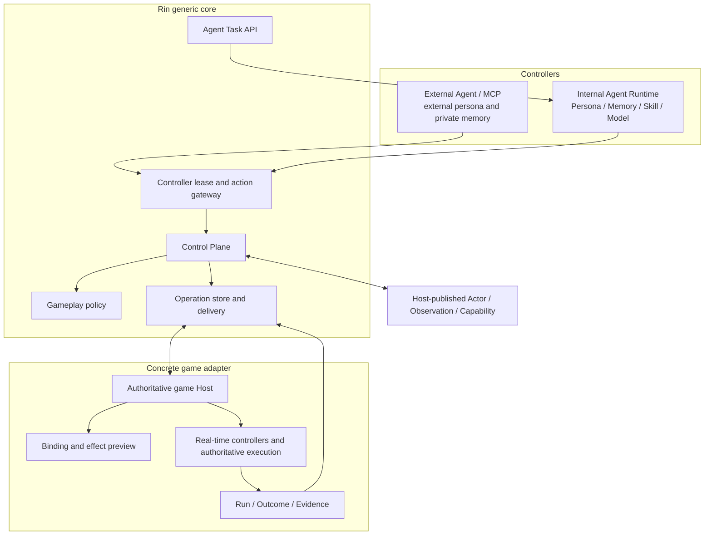
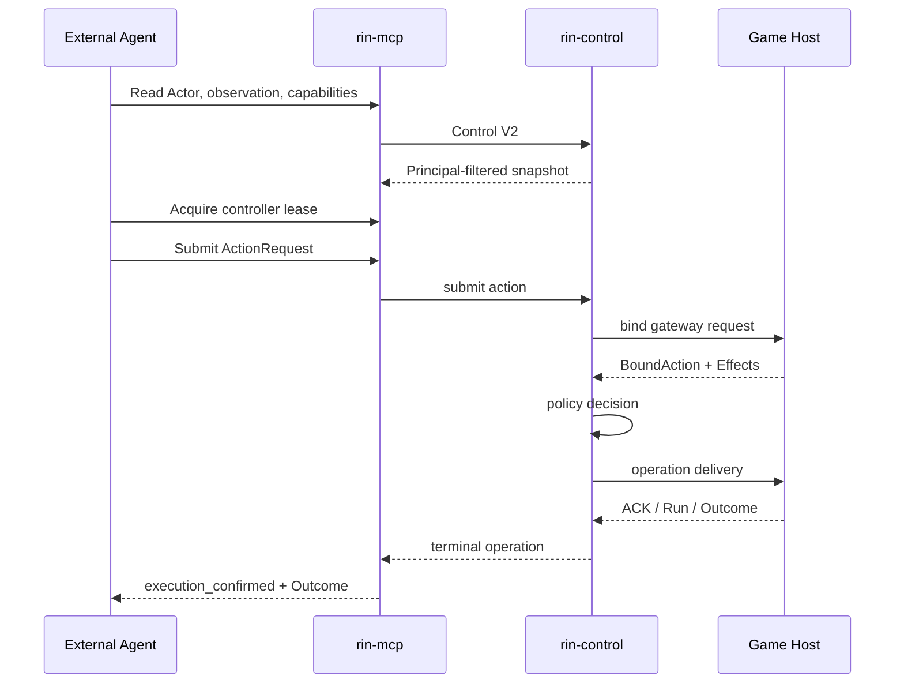

# Architecture

[English](architecture.md) | [简体中文](architecture.zh-CN.md)

Rin is a game Agent harness, not a game engine, NPC implementation, or complete
Agent framework. It places a controller's semantic intent onto a constrained,
recoverable, auditable execution path while the game owns objects, rules,
threads, real-time control, and saves.

## Goals

- Let capable models choose actions inside a Host-published capability space
  instead of selecting from a few prewritten choices.
- Enforce actual effects in code; prompts assist decisions but never grant permission.
- Give Internal Agents, external MCP clients, and future controllers one execution path.
- Keep the core engine-neutral and lightweight. Minecraft is the first real adapter,
  not a core dependency.
- Keep models at semantic decision frequency while the game owns frame/tick control.

## Topology

```mermaid
flowchart TB
    subgraph Controllers["Controllers"]
        MCP["External Agent / MCP\nexternal persona and private memory"]
        Agent["Internal Agent Runtime\nPersona / Memory / Skill / Model"]
    end

    MCP --> Gateway["Controller lease and action gateway"]
    Agent --> Gateway

    subgraph Rin["Rin generic core"]
        Gateway --> Control["Control Plane"]
        Control --> Policy["Gameplay policy"]
        Control --> Ops["Operation store and delivery"]
        AgentAPI["Agent Task API"] --> Agent
    end

    Control <--> Catalog["Host-published Actor / Observation / Capability"]
    Ops <--> Host["Authoritative game Host"]

    subgraph Adapter["Concrete game adapter"]
        Host --> Binder["Binding and effect preview"]
        Host --> Executor["Real-time controllers and authoritative execution"]
        Executor --> Evidence["Run / Outcome / Evidence"]
    end

    Evidence --> Ops
```

## Trust boundaries

### Controller

A controller may identify an Actor, choose a capability, supply arguments and
observed opaque target references, and bind the request to an expected epoch and
observation. It cannot:

- invent unpublished capabilities or targets;
- declare ownership, effects, risk, reversibility, policy, or success;
- access engine objects, Java/C#/C++ APIs, files, shells, or consoles directly;
- interpret queue acceptance as game success.

External mode uses the external Agent's persona and private memory. Internal
mode uses Rin-configured persona, memory, and skills. Their cognition differs;
their game authority does not.

### Rin core

Rin trusts Host-authored structured identities and effects, not model prose.
The core owns:

- principals, scopes, Host leases, controller leases, and emergency stop;
- schema, digest, epoch, observation-sequence, and idempotency checks;
- deterministic effect policy, confirmation challenges, and budgets;
- operation state, delivery, cancellation, restart recovery, and reconciliation;
- bounded model context, tasks, personas, memory, and skill providers for the
  Internal Agent.

Rin does not resolve engine objects or mutate the game world itself.

### Game Host

The Host is authoritative. Only it may:

- read real state on an engine thread and publish observations;
- resolve `HostRef` values, normalize arguments, and create a `BoundAction`;
- derive effect previews from actual game objects;
- recheck game rules and TOCTOU conditions immediately before execution;
- drive real-time navigation, combat, building, and similar controllers;
- produce the single authoritative outcome from observed results.

## Two cognition entrances, one execution path

### External MCP

```mermaid
sequenceDiagram
    participant E as External Agent
    participant M as rin-mcp
    participant C as rin-control
    participant H as Game Host
    E->>M: Read Actor, observation, capabilities
    M->>C: Control V2
    C-->>M: Principal-filtered snapshot
    E->>M: Acquire controller lease
    E->>M: Submit ActionRequest
    M->>C: submit action
    C->>H: bind gateway request
    H-->>C: BoundAction + Effects
    C->>C: policy decision
    C->>H: operation delivery
    H-->>C: ACK / Run / Outcome
    C-->>M: terminal operation
    M-->>E: execution_confirmed + Outcome
```

`rin-mcp` is a stateless proxy. Closing it does not stop the daemon or game,
and multiple MCP clients do not contend for a listen port. The exclusive item
is an Actor's controller lease, not an MCP process.

### Internal Agent

The Internal Agent accepts asynchronous tasks and loops through
`Observe -> Recall -> Decide -> Act -> Verify`. A model receives bounded summaries
and at most one detailed capability or skill inspection. Closed-schema output is
checked against the allowed set and converted into the same `ActionRequest` used
by MCP.

Completion follows caller-owned acceptance criteria: new tasks default to human
confirmation; `host-evidence` checks current Host facts or matching confirmed
operations. Explicit `model-declared` accepts model judgment once any Plan is
complete and provides no independent goal proof. Existing tasks retain their
original policy. Provider failures, authority changes and exhausted budgets pause
or end work. Unknown results stop deliberation while reconciliation continues.

## State ownership

| State | Owner | Persistence |
| --- | --- | --- |
| World, entities, inventory, narrative canon | Game Host | game save |
| Actor authority and safety configuration | Game Host | same game save |
| Host and controller leases | Control Plane | runtime projection, rebuilt on reconnect |
| Action operations and outcomes | Control Plane | Control data directory |
| Internal Agent tasks and subjective memory | Agent Runtime | `agent/tasks.db`, `agent/memory.db` |
| Signal inbox and delivery diagnostics | Control daemon | `agent/signals.db`, bounded by Epoch and TTL |
| Decision diagnostics | Agent Runtime | `agent/decision-records.db`, bounded row retention |
| Persona, skills, and provider configuration | Administrator | private Agent configuration file |
| External Agent persona and private memory | External Agent | not copied by Rin |

V2 promises persistence inside one game save. It does not enable cross-save,
cross-server, or cross-game persona and memory synchronization by default.

## Timing model

Model and MCP calls are not frame-level control. The expected rhythm is:

- the Host periodically publishes a bounded read model;
- a controller makes a semantic decision on an event, task phase, or meaningful change;
- the adapter executes an authorized long-running task on game ticks;
- a Run reports bounded monotonic progress and an Outcome reports trusted completion.

This low-frequency planning plus real-time local execution lets an NPC complete
continuous work without placing network latency on a render or server tick.

## Package boundaries

| Package | Responsibility |
| --- | --- |
| `host` | engine-neutral contracts and schema sealing |
| `policy` | effect authorization, confirmation, budgets, and persisted usage |
| `controlplane` | Host/controller lifecycle and operations |
| `cognition` | persona, memory, skills, model wrapping, and Agent loop |
| `agentapi` / `agentdaemon` | asynchronous Task HTTP and background scheduling |
| `mcpbridge` | MCP tool mapping to Control V2 |
| `sdk/hostkit` | adapter authority-dispatch helpers |
| `examples/adapters` | validation implementations never imported by the core |

An architecture test rejects production core imports of game examples,
adapters, mods, Minecraft, or Fabric types.

## Failure model

- An operation never collected before Host disconnect eventually becomes `stale`.
- A Host-accepted operation awaiting reconciliation may be redelivered or become
  `outcome-unknown`; Rin never guesses the result.
- Controller lease, authority revision, or epoch changes fence old intent.
- Emergency stop blocks new actions and requests cancellation of unfinished work.
- One data directory permits one writer process; multi-instance writes on a
  shared filesystem are unsupported.

See [operations and policy](operations.md) and the [Host V2 contract](host-contract.md)
for detailed semantics.
