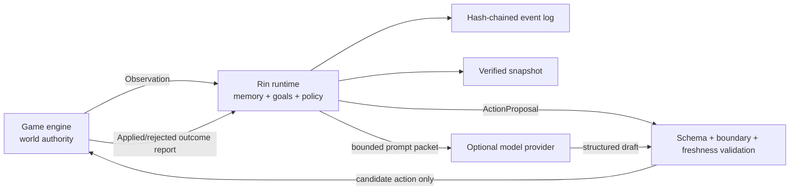

# 架构

[English](architecture.md) | [简体中文](architecture.zh-CN.md)

Rin 是管理智能体状态与决策的引擎中立控制层，不是模拟或修改游戏世界的权威。

## 权威边界



游戏引擎始终拥有世界权威。Rin 不直接修改场景、任务、物品、战斗、角色位置、关键选择或存档。Policy 只能从本次请求的 `candidate_actions` 中选择一个动作；运行时还会检查角色、目标、记忆引用、边界、会话 revision 和内容绑定。

## 组件

### 协议

`protocol` 是唯一需要被其他语言复刻的层。所有请求显式携带 `rin.protocol/v1`，未知 JSON 字段会被 HTTP 层拒绝，标识符禁止路径分隔符。

### 运行时

`runtime.Engine` 是确定性状态机。每个会话单独加锁；Policy 在锁外执行，因此远程模型变慢不会阻塞新的观察或读状态。旧会话继续用 revision/head hash 判断应用前的 Proposal 是否过期；显式启用 `outcome-reporting-v1` 的会话采用下文“游戏先处理、再回报”和发生时间合并语义。启用 `arbitration-v1` 的会话使用随权威 Observation 和 Outcome 结算前进的 `world_revision`，因此同一轮多个角色可以并行提出动作。游戏已经处理的 Outcome 即使延迟到达也会被记录，不再作为应用前 Proposal 重新判断新鲜度。

详细记忆保持固定窗口；`memory-archive-v1` 将最旧批次压成带来源 ID、tick 范围和原因的确定性摘要，并在摘要达到上限后继续分层合并。`belief-conflicts-v1` 为每个角色保留最多八条来源声明，同时维持旧 `beliefs` 字段作为当前选中投影。两者都完全由事件重放恢复，不依赖向量数据库。

持久 Request 身份有意与这些有界 cognition 投影分离。每个 managed Session 都
保留一份 `identifier-history-v1` ledger：Request entry 将 mutation 类型和
canonical typed-request digest 绑定到原始结果，Event entry 则永久记录每个
已接受的 Observe/Outcome Event ID。`SessionState.Receipts` 仍是 1,024 项的
兼容与诊断热投影；淘汰 Receipt 不会删除 Identifier History。

Request digest 是请求经严格 typed 解码后 canonical JSON 的 SHA-256。完全相同
的重试因此忽略 Object 成员顺序和空白，但必须匹配每个 typed 字段与数组顺序。
duplicate 会返回原始 Mutation revision/head 或 typed Proposal/Arbitration，
并设置 `duplicate=true`。这些坐标标识首次操作，不是当前 live head。

### 策略

Policy 接口只返回 `ProposalDraft`。运行时不信任实现：动作必须来自白名单，记忆和目标 ID 必须真实存在，文本长度与 stance 必须合法。

内置 `policy.Deterministic` 是离线基线：

1. 标签命中边界时只选择对应的 `refuse`、`redirect` 或 `wait` 动作。
2. 否则优先服务高优先级主动目标。
3. 用重要度、近期性、标签和召回次数选择最多三条记忆。
4. 对重复动作降权，以固定 seed 和请求上下文确定性打破平局。

在线模型 Policy 只替换第 2–4 步，不绕过运行时验证器。

### 模型策略

模型 Policy 只构造最小上下文包。系统指令与游戏数据分成两个 message，玩家输入、剧情文本和内容包字段全部位于 `untrusted_game_data`；同时给出独立 `contract`，列出唯一合法的 action、memory 和 goal ID。供应商即使不支持严格 JSON Schema，返回结果仍会在本地执行 unknown-field、类型、长度和 ID 白名单校验。

角色边界在调用供应商之前本地处理。触发边界时直接使用 `boundary-guard`，不会依赖模型自行拒绝。

### 供应商韧性

OpenAI-compatible 客户端由标准库实现。每次调用具有 attempt timeout 和 total timeout，只重试网络、429、408 和 5xx 等暂时错误；连续失败会打开 circuit breaker，开放期直接进入离线回退。响应正文、Prompt 和 Key 不写入错误、日志或状态。

模型 Draft 按 Session head hash、Actor 和语义请求建立有界内存缓存。相同 key 的并发调用合并成一次供应商请求；状态变化后 head hash 改变，旧结果不会命中新世界状态。

### 异步任务

`jobs.Manager` 使用有界 worker 和 queue。游戏先提交 `/v1/jobs/propose`，继续渲染与接收输入，再通过 GET 轮询。若思考期间 Session 变化，Job 结束为 `stale`，不会写入旧提案；取消会沿 context 传递到 HTTP Provider。

Job 元数据只在进程内保留，并可能在 retention TTL 后淘汰。成功 Proposal 本身
已经进入事件日志；Job 被淘汰或 Sidecar 重启后，客户端可以重新提交完全相同
的请求，Engine 的持久 Session 身份 ledger 会返回原始 Proposal，但进程内 Job
记录需要重建。Job 时间戳和中间状态不持久。

### 结构化生成

`generation.Manager` 为游戏拥有的受限 Prompt 提供另一条有界异步队列。它
复用同一个 resilient Provider，但不接触 Session State，也不写事件日志。同一
请求只在进程内 Job 记录仍保留时去重；去掉 request ID 后的语义内容只做短期
缓存。Job 淘汰或重启后，完全相同的请求仍可能再次调用 Provider。取消沿
context 传播到 Provider。

Generation 只保证传输、大小和顶层 JSON Object 合法。各游戏仍必须验证自己的 `ScenePacket`、任务、对白或结局 Schema。若验证失败，游戏丢弃结果并使用本地内容；模型输出永远不会自动成为 Canon。

### 游戏适配器

Ren'Py、Godot 和 Unity 适配器只转换 JSON/HTTP 与各自的异步机制，不复制 Runtime 状态机。在线结果带 `committable=true`，表示游戏处理后可向 Sidecar 回报该 Proposal ID，而不是 Rin 授权执行。只有确定在线提交从未创建 Proposal（例如 Sidecar 已禁用或初始连接被拒绝）时，适配器才能从游戏本次候选列表选择 authored fallback，并标记 `committable=false`；提交、轮询、超时或取消结果尚未确认时必须 fail closed。游戏不得把本地 `offline.*` ID 发给 `/commit`。

Ren'Py worker registry、Godot `HTTPRequest` 和 Unity coroutine 都只存在于进程内。游戏存档保存 Snapshot 与普通结果，不保存线程、Future、Socket、HTTP 对象或 API Token。

### 多角色协调

候选目标仍由游戏提供上限和语义范围，Policy 只能建议采用；启用 `outcome-reporting-v1` 后，只有游戏已经应用并以 accepted Commit 回报的目标才写进 Actor。Activity 状态由游戏的区域或模拟系统更新，Dormant 角色不会自行唤醒。Arbitration 对同一 world revision 的 Proposal 做稳定排序并记录冲突，但不执行动作；游戏可以调整、拒绝，再以原子 Batch Commit 汇报实际结果。完整事务与 Outbox 规则见[动作结果记账](outcome-reporting.zh-CN.md)。

这使 Rin 可以服务视觉小说、RPG NPC 和模拟居民，同时不承担寻路、碰撞、任务规则或 Scene Tree 等引擎职责。

### 可观测性

Timeline 只从事件 payload 提取 ID 和枚举状态，不返回玩家原话、剧情摘要、Commit outcome 或模型内容。Replay 则运行同一个 reducer 到指定 revision，生成完整且可验证的 Snapshot，不写回 Store。`rin inspect` 复用这两条路径输出机器可读诊断；打开数据目录时仍会验证全部事件 hash chain。

Replay State 对应指定 revision，但 Snapshot 会携带完整的本地 lineage
Identifier History，包括在所选 State revision 之后产生的 tombstone；否则
Restore 较旧 Replay 结果会让后来的 ID 重新可用。因此 Identifier result
revision 可以大于重放 State revision。

### Mutation 与状态闭包

每个事件都先应用到隔离的候选 State。Reducer 随后校验完整
`SessionState`，包括 Feature 门禁、容量、revision/tick 上界、Actor 引用和
成对的 Belief 投影；只有通过校验的候选状态才能追加到 Store 并发布为 live
State。因此 reducer 或候选校验失败既不会改变事件日志，也不会改变内存中的
Session。Store 写入失败则遵循 outcome 协议单独定义的 append 确认与对账规则。

Identifier History 采用同一 durability boundary。成功 append 会同时发布 State
和对应 Request/Event ID entry；失败或未决 append 既不能暴露没有事件的
tombstone，也不能暴露没有 tombstone 的事件，对账会从确认持久的 tail 同时
恢复两者。

Store 错误导致 append 是否持久化无法确定时，Engine 不会发布候选 State 或
Identifier History，而是为该精确逻辑事件保留一道 uncertainty barrier：只有
mutation 类型与 canonical typed-request digest 都相同的请求可以尝试确认，
该 Session 的其他 mutation 全部在它之后 fail closed。非 Proposal 操作暴露
`mutation_outcome_unknown`；Proposal 为保持线格式兼容继续使用
`proposal_outcome_unknown`。exact retry 成功后，Engine 对账已确认的持久 tail，
并且只发布一次 State 与 Identifier History。Create 与 fresh Restore 也会在
把 Session 注册进内存前遵循同一规则。

Policy 调用收到 State、Actor 和请求的隔离副本。Policy 可以在本地读取或修改
这些值，但不能绕过事件直接改变 live Session。Runtime 的有界保留也会闭合
引用：Memory 归档会把 recalled ID 改写到替代 Summary，未启用归档时会移除
被淘汰的引用，Belief 与 BeliefSet 则按确定性顺序成对淘汰。

### 存储

同一 Session 的所有 Store 操作必须可线性化，且 `Load` 对 `Create` 与
`Append` 提供 read-after-write 强一致性。Engine 会把 Create 失败后立即得到
`ErrNotFound` 视为“首事件确定未写入”，并把 Append 失败后立即读到权威旧 tail
视为“候选事件确定未写入”。自定义 Store 若不能保证任一观察具有权威性，就
必须让 `Load` 返回 uncertainty error，绝不能返回陈旧数据；最终一致 Store
不满足 Runtime 的 Store 契约。

文件存储结构：

```text
rin-data/
└── sessions/
    └── session.id/
        ├── events.jsonl
        └── snapshot-<revision>-<hash>.json
```

事件哈希覆盖 sequence、type、request ID、记录时间、上一事件哈希和 payload。启动时完整重放并验证；任何断链、改写或未知事件类型都会阻止会话加载。快照通过同目录临时文件、`fsync` 和 rename 写成按 revision/hash 命名的不可变文件，权限为 `0600`，不依赖各平台不同的覆盖 rename 行为。

启动时还会从完整本地事件链重建永久 Identifier History。旧 entry 若无法恢复
完整 request digest，或者其 ID 在历史上曾被重复使用，就会成为 ambiguous
tombstone：旧日志仍可读取，但后来请求不能安全复用该 ID。

Snapshot 的 `state_hash` 覆盖有界 State，`identifier_history_hash` 则独立覆盖
canonical `identifier_history`，包括 `identifier-history-v1` 版本与
`coverage_complete` 标记。History 会保留原始 Proposal/Arbitration 结果，因此
随 mutation 线性增长，也可能重新携带已从 cognition State 淘汰的文本。
Snapshot 文件和正文必须使用与完整事件日志同级的保密控制。

文件 Store 是单写者设计：同一数据目录同时只能由一个 Rin 进程使用。需要多实例时应实现外部协调的 Store，而不是共享 JSONL 目录。

## NPC 调度

每个 Actor 声明 `think_every_ticks`。游戏应用动作并以 accepted Commit 回报后，
`next_think_tick = max(current, commit.tick + think_every_ticks)`，因此延迟结果
不会让调度倒退。游戏可在区域进入、回合结束、分钟推进或关键事件后调用
`/v1/scheduler/due`，不应在渲染帧中轮询模型。

紧急事件可在 propose 请求中设置 `urgent: true`，但它只绕过调度时间，不绕过边界和动作白名单。

## 存档与回滚

- 游戏存档应保存 Rin 返回的 Snapshot，而不是内部文件路径。
- Snapshot 带内容包 Binding 和状态哈希。Rin 在计算哈希或保存前先校验克隆的
  State，因此每个成功返回的 Snapshot 都通过与 Restore 相同的结构校验。
- 新 Snapshot 还携带 `identifier_history` 与 `identifier_history_hash`。
  History 位于有界 State 之外，保存永久 Request/Event ID tombstone 和原始
  操作结果。
- 不带 History 的旧 Snapshot 仍可读取，但 coverage 永久不完整：只能从有界
  State 中仍可发现的 ID 建立索引。`coverage_complete=false` 会沿以后所有
  Snapshot 与 Restore 合并持续传播。
- 启用 `outcome-reporting-v1` 后，Restore 会保留 pending Proposal，既让存档中
  尚未处理的 Proposal Attempt 能恢复，也让 Outcome Outbox 能补报读档前已经
  应用的动作。恢复出的 Proposal 不授权执行；游戏必须依赖持久化 Attempt 和
  applied-operation marker 区分两种状态，重新校验尚未处理的动作，并且绝不
  重做已经处理的动作。
- 未启用该 Feature 的 Session 保留旧版 Restore 行为并清空 Proposal。
- 已提交事件、记忆、事实、目标进度和调度 tick 会恢复。
- Restore 会开始一个新的本地事件链 generation；保留的 Proposal、Memory、
  Belief、Activity 和 Arbitration revision 元数据会在发布恢复状态前重基到该
  generation。导入的历史 Receipt revision 设为 0，本次 Restore Receipt 则记录
  新的本地 generation。
- Restore 会合并当前与导入的 Identifier History。被放弃的 future branch 中
  的 ID 仍作为 tombstone 保留；verified mapping 不兼容时拒绝 Restore，不会
  覆盖任一方。
- 从其他 generation 导入的 duplicate 结果保留原始操作 revision/head。这些
  坐标可能无法在新本地事件链中 Replay，不能当作其当前 head。
- 新数据目录可以导入 Snapshot；此时本地事件链从一条 restore 事件开始。
- 重复载入同一存档时，调用方应让 restore request ID 同时绑定 Snapshot hash 与当前 Sidecar head，以区分网络重试和真正的再次回档。
- Identifier History 会随 lineage 增长。当前 HTTP 请求与 SDK 响应上限仍是
  传输边界，任意长 lineage 尚不能保证用一个 JSON 请求往返。后续需要有界
  archive/streaming 传输；绝不能静默截断 History。

## 模型接入规则

推荐把模型调用实现为另一个 `Policy`，或由上层 Showrunner 先生成结构化 Draft。供应商请求必须有超时和取消，API Key 只从进程环境或宿主安全存储读取。模型不接触事件文件、快照路径、游戏脚本和任意工具执行。
