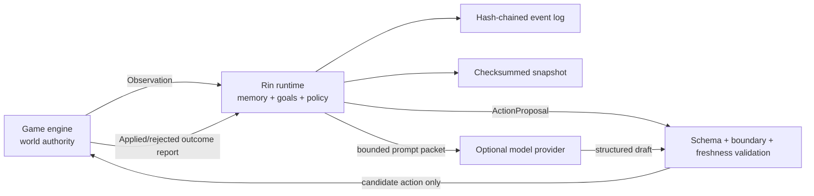

# 架构

[English](architecture.md) | [简体中文](architecture.zh-CN.md)

Rin 是管理智能体状态与决策的引擎中立控制层，不是模拟或修改游戏世界的权威。

本文描述 Rin `0.6.0` Preview。HTTP Wire Shape 以
[`api/openapi.json`](../api/openapi.json) 为准；本文解释组件和 Trust Boundary。

## 权威边界



游戏引擎始终拥有世界权威。Rin 不直接修改场景、任务、物品、战斗、角色位置、关键选择或存档。Policy 只能从本次请求的 `candidate_actions` 中选择一个动作；运行时还会检查角色、目标、记忆引用、边界、会话 revision 和内容绑定。

## 组件

### 协议

`protocol` 是唯一需要被其他语言复刻的层。所有请求显式携带 `rin.protocol/v1`，未知 JSON 字段会被 HTTP 层拒绝，标识符禁止路径分隔符。

### 运行时

`runtime.Engine` 是确定性状态机。每个会话单独加锁；Policy 在锁外执行，因此远程模型变慢不会阻塞新的观察或读状态。旧会话继续用 revision/head hash 判断应用前的 Proposal 是否过期；显式启用 `outcome-reporting-v1` 的会话采用下文“游戏先处理、再回报”和发生时间合并语义。启用 `arbitration-v1` 的会话使用随权威 Observation 和 Outcome 结算前进的 `world_revision`，因此同一轮多个角色可以并行提出动作。游戏已经处理的 Outcome 即使延迟到达也会被记录，不再作为应用前 Proposal 重新判断新鲜度。

详细记忆保持固定窗口。`memory-archive-v1` 从较旧的一半中确定性选择低显著性
批次，再生成带 tick 范围和代表性来源 ID 的有界、有损 Summary。分层文本会
预留最旧 head 锚点，为高重要度与较近期片段分配更多预算，并预留最新 tail；
来源取样保留已知最旧与最新 ID，其余槽位按所代表的 tick 范围分布。高重要度
只会提高保留预算，并不保证文本永久跨越此后的每次合并。

超过 32 条 Summary 时，Runtime 继续合并时间最旧的四条直接 Summary lineage。
该成员关系与 Summary ID 派生必须稳定，因为旧 `proposal.created` 事件可能已在
`recalled_memory_ids` 中持久化其中一个 ID。`belief-conflicts-v1` 为每个角色
保留最多八条来源声明，同时维持旧 `beliefs` 字段作为当前选中投影。两者都完全
由事件重放恢复，不依赖向量数据库。

Memory 压缩只是认知遗忘：它不会删除或脱敏权威事件日志，不会抹除永久
Identifier History，也不是隐私擦除机制。Replay、checkpoint、备份及仍被保留的
Snapshot 可能继续包含已经不在有界 cognition State 中的文本。

持久 Request 身份有意与这些有界 cognition 投影分离。每个 managed Session 都
保留一份 `identifier-history-v1` ledger：Request entry 将 mutation 类型和
canonical typed-request digest 绑定到原始结果，Event entry 则永久记录每个
已接受的 Observe/Outcome Event ID。`SessionState.Receipts` 仍是 1,024 项的
兼容与诊断热投影；淘汰 Receipt 不会删除 Identifier History。

Request digest 是请求经严格 typed 解码后 canonical JSON 的 SHA-256。完全相同
的重试因此忽略 Object 成员顺序和空白，但必须匹配每个 typed 字段与数组顺序。
duplicate 会返回原始 Mutation revision/head 或 typed Proposal/Arbitration，
并设置 `duplicate=true`。这些坐标标识首次操作，不是当前 live head。

### 策略

Policy 接口只返回 `ProposalDraft`。运行时不信任实现：动作必须来自白名单，记忆和
目标 ID 必须真实存在，stance 必须合法；角色边界被触发时还必须选择游戏编写的响应动作。
`ProposalDraft.Summary` 与 `ProposalDraft.Rationale` 只为 Go 源码兼容保留，
永远不会发布。

运行时是唯一的玩家文本信息流门禁：`ActionProposal.summary` 一律由选中的、
游戏编写的 `ActionSpec.description` 重建，`ActionProposal.rationale` 一律
来自固定 stance 模板。Goal、Boundary、Memory、Belief、Prompt 和 Provider 文本
都不是该函数的输入。这是按构造隔离，不是私密字符串黑名单。
`goal_id`、`boundary_id`、`recalled_memory_ids`、`policy_source` 以及完整
`proposed_goal` 保留私有的结构化审计/集成数据，玩家 UI 不得直接显示。
Action 里只有显式授权展示的 `description` 可作为文案；ID、Kind、Target 与
Parameter 仍是集成数据，除非游戏另行授权。

Reducer 投影 `rin.reducer-projection/v2` 会对旧 `proposal.created` 事件、导入
Snapshot、保留的 Recent Action、Checkpoint 与持久化 exact-retry 结果执行同样
的重建。变化只发生在派生展示投影中：权威事件字节、事件 Hash、Request/Result
坐标、动作与审计 ID 都不变。因此旧 Proposal 的 exact retry 可返回升级后的
`summary`/`rationale`，同时保留原 Revision 与 Head。原始 Event 和 Restore
Payload 仍可能含有旧私密字符串，升级不会擦除这些底层记录。

内置 `policy.Deterministic` 是离线基线：

1. 标签命中边界时只选择对应的 `refuse`、`redirect` 或 `wait` 动作。
2. 否则优先服务高优先级主动目标。
3. 用重要度、近期性、标签和召回次数选择最多三条记忆。
4. 对重复动作降权，以固定 seed 和请求上下文确定性打破平局。

在线模型 Policy 只替换第 2–4 步，不绕过运行时验证器。

### 模型策略

模型 Policy 只构造最小上下文包。系统指令与游戏数据分成两个 message，玩家输入、剧情文本和内容包字段全部位于 `untrusted_game_data`；同时给出独立 `contract`，列出唯一合法的 action、memory 和 goal ID。供应商即使不支持严格 JSON Schema，返回结果仍会在本地执行 unknown-field、类型、长度和 ID 白名单校验。

角色边界在调用供应商之前本地处理。触发边界时直接使用 `boundary-guard`，不会依赖
模型自行拒绝。模型输出 Schema 不包含 `summary` 或 `rationale`；返回其中任一字段
都会按未知字段失败。Prompt 明确禁止复制私有决策文本，而运行时玩家文本门禁对自定义
Policy 与不合规 Provider 同样是最终权威。

### 供应商韧性

OpenAI-compatible 客户端由标准库实现。每次调用具有 attempt timeout 和 total timeout，只重试网络、429、408 和 5xx 等暂时错误；连续失败会打开 circuit breaker，开放期直接进入离线回退。原始 Provider HTTP 正文、Prompt 和 Key 不写入错误、日志或持久 Session State。经验证的结构化 Generation Result 会保留在有界进程内 Job Record 与 Semantic Cache 中，直到返回调用方；它仍是不可信的调用方 Content。

Attempt 与 total deadline 依赖 `provider.Client` 的协作取消硬契约：实现必须观察
`ctx.Done()` 并及时返回。Go 无法强制抢占一个永久阻塞的第三方 Client。

模型 Draft 按 Session head hash、Actor 和语义请求建立有界内存缓存。相同 key 的并发调用合并成一次供应商请求；状态变化后 head hash 改变，旧结果不会命中新世界状态。

### 异步任务

`jobs.Manager` 使用有界 worker 和 queue。游戏先提交 `/v1/jobs/propose`，继续渲染与接收输入，再通过 GET 轮询。若思考期间 Session 变化，Job 结束为 `stale`，不会写入旧提案；取消会沿 context 传递到 HTTP Provider。

Job 元数据只在进程内保留，并可能在 retention TTL 后淘汰。成功 Proposal 本身
已经进入事件日志；Job 被淘汰或 Sidecar 重启后，客户端可以重新提交完全相同
的请求，Engine 的持久 Session 身份 ledger 会返回原始 Proposal，但进程内 Job
记录需要重建。Job 时间戳和中间状态不持久。

### 结构化生成

`generation.Manager` 为游戏拥有的受限 Prompt 提供另一条有界异步队列。它
复用同一个 resilient Provider，但不接触 Session State，也不写事件日志。同一
请求只在进程内 Job 记录仍保留时去重；去掉 request ID 后的语义内容只做短期
缓存。Job 淘汰或重启后，完全相同的请求仍可能再次调用 Provider。取消沿
context 传播到 Provider。

Generation 只保证传输、大小和顶层 JSON Object 合法。各游戏仍必须验证自己的 `ScenePacket`、任务、对白或结局 Schema。若验证失败，游戏丢弃结果并使用本地内容；模型输出永远不会自动成为 Canon。

### 游戏适配器

Ren'Py、Godot 和 Unity 适配器只转换 JSON/HTTP 与各自的异步机制，不复制 Runtime 状态机。在线结果带 `committable=true`，表示游戏处理后可向 Sidecar 回报该 Proposal ID，而不是 Rin 授权执行。只有确定在线提交从未创建 Proposal（例如 Sidecar 已禁用或初始连接被拒绝）时，适配器才能从游戏本次候选列表选择 authored fallback，并标记 `committable=false`；提交、轮询、超时或取消结果尚未确认时必须 fail closed。游戏不得把本地 `offline.*` ID 发给 `/commit`。

Ren'Py worker registry、Godot `HTTPRequest` 和 Unity coroutine 都只存在于进程内。游戏存档保存 Snapshot 与普通结果，不保存线程、Future、Socket、HTTP 对象或 API Token。

### 多角色协调

候选目标仍由游戏提供上限和语义范围，Policy 只能建议采用；启用 `outcome-reporting-v1` 后，只有游戏已经应用并以 accepted Commit 回报的目标才写进 Actor。Activity 状态由游戏的区域或模拟系统更新，Dormant 角色不会自行唤醒。Arbitration 对同一 world revision 的 Proposal 做稳定排序并记录冲突，但不执行动作；游戏可以调整、拒绝，再以原子 Batch Commit 汇报实际结果。完整事务与 Outbox 规则见[动作结果记账](outcome-reporting.zh-CN.md)。

这使 Rin 可以服务视觉小说、RPG NPC 和模拟居民，同时不承担寻路、碰撞、任务规则或 Scene Tree 等引擎职责。

### 可观测性

Timeline 只从事件 payload 提取 ID 和枚举状态，不返回玩家原话、剧情摘要、
Commit outcome 或模型内容。在随附 File Store 上，Timeline 读取有界 revision
range，不会为每一页重新对完整日志运行 reducer。Replay 使用不晚于目标
revision 的最新可用 checkpoint，再对剩余 tail 运行正常 reducer，生成完整且
可验证的 Snapshot，但不会把导出的 Snapshot 写回 Store。Session 加载完成后，
Timeline 与 Replay 只在 Session lock 下捕获 live boundary，随后释放 mutation
lock，再执行 range I/O 与重放；第一次 lazy load 仍会串行完成。`rin inspect`
复用这两条路径输出机器可读诊断。健康 revision index 可让它直接定位请求的
Timeline 尾部窗口，不会仅为了保留最后几条 entry 而从 genesis 向前分页。

Replay State 对应指定 revision，但 Snapshot 会携带完整的本地 lineage
Identifier History，包括在所选 State revision 之后产生的 tombstone；否则
Restore 较旧 Replay 结果会让后来的 ID 重新可用。因此 Identifier result
revision 可以大于重放 State revision。

Engine Open 有意采用 lazy load：它只枚举 Session ID，不读取每个 Session 的
全部历史。对某 Session 的第一次操作才通过 checkpoint + tail 恢复路径校验并
加载该 Session。恢复成功后，如果没有选中可用 checkpoint，或
`head revision / 所选 checkpoint revision >= 2`，Runtime 会 best-effort
异步排队一个恢复出的 head checkpoint；read 返回时它可能尚未持久化。这个
派生缓存写入不属于 read 成功边界，失败会被忽略；有界 worker 与并发契约见
[存储](#存储)。`Engine.VerifyAll()` 是显式运维操作，会忽略 checkpoint，从
genesis 到 head 重放并审计每个 Session 的完整 hash chain。普通 `rin inspect`
只读取指定 Session，不会隐式执行整个数据目录的全量审计。

### Mutation 与状态闭包

每个事件都先应用到隔离的候选 State。Reducer 随后校验完整
`SessionState`，包括 Feature 门禁、容量、revision/tick 上界、Actor 引用和
成对的 Belief 投影；只有通过校验的候选状态才能追加到 Store 并发布为 live
State。因此 reducer 或候选校验失败既不会改变事件日志，也不会改变内存中的
Session。Store 写入失败则遵循 outcome 协议单独定义的 append 确认与对账规则。

Identifier History 采用同一 durability boundary。成功 append 会同时发布 State
和对应 Request/Event ID entry；失败或未决 append 既不能暴露没有事件的
tombstone，也不能暴露没有 tombstone 的事件，对账会从确认持久的 tail 同时
恢复两者。

Store 错误导致 append 是否持久化无法确定时，Engine 不会发布候选 State 或
Identifier History，而是为该精确逻辑事件保留一道 uncertainty barrier：只有
mutation 类型与 canonical typed-request digest 都相同的请求可以尝试确认，
该 Session 的其他 mutation 全部在它之后 fail closed。非 Proposal 操作暴露
`mutation_outcome_unknown`；Proposal 为保持线格式兼容继续使用
`proposal_outcome_unknown`。exact retry 成功后，Engine 对账已确认的持久 tail，
并且只发布一次 State 与 Identifier History。Create 与 fresh Restore 也会在
把 Session 注册进内存前遵循同一规则。

Policy 调用收到 State、Actor 和请求的隔离副本。Policy 可以在本地读取或修改
这些值，但不能绕过事件直接改变 live Session。Runtime 的有界保留也会闭合
引用：Memory 归档会把 recalled ID 改写到替代 Summary，未启用归档时会移除
被淘汰的引用，Belief 与 BeliefSet 则按确定性顺序成对淘汰。

### 存储

同一 Session 的所有 Store 操作必须可线性化，且 `Load` 对 `Create` 与
`Append` 提供 read-after-write 强一致性。Engine 会把 Create 失败后立即得到
`ErrNotFound` 视为“首事件确定未写入”，并把 Append 失败后立即读到权威旧 tail
视为“候选事件确定未写入”。自定义 Store 若不能保证任一观察具有权威性，就
必须让 `Load` 返回 uncertainty error，绝不能返回陈旧数据；最终一致 Store
不满足 Runtime 的 Store 契约。

文件存储结构：

```text
rin-data/
├── .rin.lock
└── sessions/
    └── session.id/
        ├── events.jsonl
        ├── events.idx
        ├── checkpoint-<revision>-<hash>.json
        └── snapshot-<revision>-<hash>.json
```

事件哈希覆盖 sequence、type、request ID、记录时间、上一事件哈希和 payload。
`events.jsonl` 是权威数据，采用 `retain_forever`：Rin 不会自动删除或压缩事件，
因为 Replay、永久 Request/Event ID 身份与审计都依赖完整 lineage。运维方必须
按该策略规划容量、备份与归档，不能在 Rin 背后删除正在使用的日志。

事件链使用无密钥 SHA-256，可发现断裂或未同步编辑的 History，但不是签名、MAC
或来源证明。能替换完整 Log 的一方可以重算全部 Event Hash 与派生 Artifact。
因此，对抗性防篡改依赖外部访问控制；需要时还要使用独立保护的外部 Anchor。

`events.idx` 是 revision/offset/hash 派生索引，用于读取 head 与有界 range。
索引缺失、陈旧或格式错误时，会从 `events.jsonl` 原子重建；重建会完整扫描
一次日志。健康索引在第一次访问后缓存，因此后续 Timeline page 不会反复扫描
或 materialize 完整事件日志。删除索引不会丢失权威数据，但下一次访问要承担
重建成本。

基础 `Store` API 保持源码兼容；可选 `RangeStore` 提供 `Head` 与有界
`LoadRange`，可选 `CheckpointStore` 提供 `LoadCheckpoint` 与
`SaveCheckpoint`。Checkpoint 加速要求同一个 Store 同时实现这两个接口，因为
Runtime 需要通过 `RangeStore` 校验 checkpoint 的 event-chain anchor。内部
checkpoint 使用
`CheckpointFormatVersion = "rin.checkpoint/v1"` 和
`ReducerProjectionVersion = "rin.reducer-projection/v2"`。Projection v2
引入公平的有界 Memory 文本/来源取样，以及由游戏文本规范化生成的 Proposal
展示投影；Summary lineage ID 与 v1 保持兼容，因此已经持久化的 recalled 引用
仍能重放。v1 checkpoint 会被视为过期并回退到更旧的兼容 candidate 或 genesis，
权威事件日志不会改变。Checkpoint 是派生缓存，不是公共 Snapshot、备份或权威
来源，并包含 Session/revision/head anchor、lineage
epoch、完整 State 与 Identifier History 投影以及 checksum。Runtime 使用前会
校验 wrapper、projection version、checksum、内含 Snapshot 以及对应 event-chain
anchor。checkpoint 缺失、损坏、过期或不匹配时，会尝试更旧 candidate，最终
回退到 genesis replay。checksum 只能发现意外损坏，不提供认证或来源证明。
checkpoint 写入失败不会撤销已经持久的 mutation，也不会让成功恢复的 read 失败。

Runtime 会在 Session 创建后（包括 Restore 新建 Session）排队 revision 1
checkpoint，之后只在大于等于 256 的二次幂 revision 自动排队。它不会在每个
256 倍数或每次后续 Restore 都写 checkpoint。成功 lazy recovery 时，仅在没有
可用 checkpoint，或 `head revision / 所选 checkpoint revision >= 2` 时排队
修复；较短的有效 tail 不会导致每次重启都重写 exact-head checkpoint。

checkpoint 构建与持久化是 best-effort 异步工作。持有 Session mutation lock
期间，Runtime 只捕获已发布且不可变的 State 引用，并浅拷贝 Identifier History
的两个 map；ledger entry 插入后不可变。完整 clone、校验、hash 与
`SaveCheckpoint` I/O 都在该锁之外执行。在一个 Engine 内，每个 managed
Session 最多只有一个 worker 和一个 latest pending capture，因此 active save
期间跨过多个阈值时，只保留最新 pending revision。多个 Engine 共享 Store 时，
各自都可能拥有这样的 worker。mutation 或成功的 lazy read 不等待派生
checkpoint 完成，所以调用返回时 checkpoint 可能尚不可见。

同一 Session 的 `SaveCheckpoint` 可能与 `Append`、`Load`、`Head` 或
`LoadRange` 并发。CheckpointStore 必须 concurrency-safe，并把昂贵的派生
artifact 工作与权威事件操作所需的同步隔离。Runtime 不提供 Close/drain：
如果 Store 永久阻塞 `SaveCheckpoint`，该 Engine 中对应 managed Session
唯一且有界的 worker 可能一直滞留，但不得改变 durable mutation 的结果。File
Store 默认保留每个 Session 最近 2 个有效 checkpoint 文件。Checkpoint 不会
经过 Snapshot JSON API，因此有意不应用公共 16 MiB inline Snapshot 上限；
但它仍是与事件日志同敏感级别的数据。

公共 Snapshot 文件按 revision 与 State hash 命名，但其路径内容并非不可变。
File Store 会原子替换同一路径，以修复损坏 artifact，或持久化 State
revision/hash 相同但 Identifier History 更新的 Snapshot。使用方必须校验
`identifier_history_hash`，不能把文件名当作完整 Snapshot identity。File Store
默认保留每个 Session 最近 2 个有效 Snapshot 文件。该保留策略只清理本地文件，
既不截断 Identifier History，也不改变 Snapshot/Replay/Restore 的 16 MiB
inline 契约。

Snapshot 的 `state_hash` 覆盖有界 State，`identifier_history_hash` 则独立覆盖
canonical `identifier_history`，包括 `identifier-history-v1` 版本与
`coverage_complete` 标记。History 会保留原始 Proposal/Arbitration 结果，因此
随 mutation 线性增长，也可能重新携带已从 cognition State 淘汰的文本。
Snapshot 文件和正文必须使用与完整事件日志同级的保密与完整性控制。这些
SHA-256 值是 canonical checksum：可发现意外损坏或未更新 checksum 的修改，
但不是签名或来源证明，无法阻止能重算 checksum 的修改者。Snapshot 是可信、
不透明的序列化状态，不是不可信输入的导入格式。

File Store 打开数据目录前会在 `.rin.lock` 取得 non-blocking exclusive lease。
第二个进程打开同一目录会失败；lease 一直保持到
`(*store.File).Close`，该方法幂等且会等待正在执行的 Store 调用。嵌入式用户
因此必须始终调用 `Close`；`rin serve` 与 `rin inspect` 命令会自动调用它。
随附 `flock` 实现当前只支持 `darwin` 与 `linux`。其他所有 GOOS 上，
`store.OpenFile` 会返回 `ErrDataDirectoryLockUnsupported` 并 fail closed，
不会在缺少单写者保证时返回可用的 File Store。多实例部署必须实现外部协调的
Store，不能共享 JSONL 目录。

随附 File Store 只支持 `flock`、同目录原子 rename、file `fsync` 与 directory
`fsync` 都具有可靠本地语义的本地文件系统。即使只有一个 Rin 进程，也不支持
NFS、SMB、FUSE mount 或云同步目录。远程或共享存储必须使用外部协调的 Store，
不能让 JSONL Store 直接指向这些目录。

文件创建与 append 会同步 `events.jsonl`，对应索引写入单独同步。新 Session
目录 rename 到位后还会同步父目录。Snapshot、checkpoint 与重建索引均通过
`0600` 临时文件、file `fsync`、rename 和 directory `fsync` 发布；保留策略删除
旧文件后也会再次 directory `fsync`。如果事件已持久而索引更新前崩溃，留下的
陈旧派生索引会从日志重建。这些是本地文件系统 crash-consistency 措施，不是
对存储硬件、kernel、filesystem、备份或运维故障的绝对保证。

Lazy load 只是转移成本，不会让无限增长的 lineage 免费。Engine Open 成本与
Session 目录枚举相关，而不再读取每个日志正文。某 Session 第一次访问仍需
读取其索引与完整 Identifier History；索引缺失或不可用会触发
`O(total events)` 日志扫描。有可用 checkpoint 时，状态重建成本随后与
checkpoint body 及其 event tail 相关。稳态 Timeline 分页与请求的 range
相关；Replay 与目标 checkpoint tail 以及结果携带的完整 Identifier History
相关。`Engine.VerifyAll()` 为独立全量审计而有意保持
`O(total event-log bytes)`。

旧 entry 若无法恢复完整 request digest，或者其 ID 在历史上曾被重复使用，
就会成为 ambiguous tombstone：旧日志仍可读取，但后来请求不能安全复用该
ID。

## NPC 调度

每个 Actor 声明 `think_every_ticks`。游戏应用动作并以 accepted Commit 回报后，
`next_think_tick = max(current, commit.tick + think_every_ticks)`，因此延迟结果
不会让调度倒退。游戏可在区域进入、回合结束、分钟推进或关键事件后调用
`/v1/scheduler/due`，不应在渲染帧中轮询模型。

紧急事件可在 propose 请求中设置 `urgent: true`，但它只绕过调度时间，不绕过边界和动作白名单。

## 存档与回滚

- 游戏存档应保存 Rin 返回的 Snapshot，而不是内部文件路径。
- Snapshot 带内容包 Binding 和状态哈希。Rin 在计算哈希或保存前先校验克隆的
  State，因此每个成功返回的 Snapshot 都通过与 Restore 相同的结构校验。
- Restore 必须携带来自运行中游戏可信内容 manifest 的 `expected_binding`，
  调用方不得从待导入 Snapshot 推导它。它必须与 `snapshot.state.binding`
  一致；existing target Session 是第三方，其 Binding 也必须一致。Fresh
  target 只会在前两者匹配后建立。
- 新 Snapshot 还携带 `identifier_history` 与 `identifier_history_hash`。
  History 位于有界 State 之外，保存永久 Request/Event ID tombstone 和原始
  操作结果。
- 不带 History 的旧 Snapshot 仍可读取，但 coverage 永久不完整：只能从有界
  State 中仍可发现的 ID 建立索引。`coverage_complete=false` 会沿以后所有
  Snapshot 与 Restore 合并持续传播。
- 启用 `outcome-reporting-v1` 后，Restore 会保留 pending Proposal，既让存档中
  尚未处理的 Proposal Attempt 能恢复，也让 Outcome Outbox 能补报读档前已经
  应用的动作。恢复出的 Proposal 不授权执行；游戏必须依赖持久化 Attempt 和
  applied-operation marker 区分两种状态，重新校验尚未处理的动作，并且绝不
  重做已经处理的动作。
- 未启用该 Feature 的 Session 保留旧版 Restore 行为并清空 Proposal。
- 已提交事件、记忆、事实、目标进度和调度 tick 会恢复。
- Restore 会开始一个新的本地事件链 generation；保留的 Proposal、Memory、
  Belief、Activity 和 Arbitration revision 元数据会在发布恢复状态前重基到该
  generation。导入的历史 Receipt revision 设为 0，本次 Restore Receipt 则记录
  新的本地 generation。
- Restore 会合并当前与导入的 Identifier History。被放弃的 future branch 中
  的 ID 仍作为 tombstone 保留；verified mapping 不兼容时拒绝 Restore，不会
  覆盖任一方。
- 从其他 generation 导入的 duplicate 结果保留原始操作 revision/head。这些
  坐标可能无法在新本地事件链中 Replay，不能当作其当前 head。
- 新数据目录可以导入 Snapshot；此时本地事件链从一条 restore 事件开始。
- 重复载入同一存档时，调用方应让 restore request ID 同时绑定 Snapshot hash 与当前 Sidecar head，以区分网络重试和真正的再次回档。
- Identifier History 会随 lineage 增长。完整 inline Snapshot compact JSON
  上限为 16 MiB，且绝不会截断；超过后 Snapshot、Replay 或 Restore 返回
  `413 snapshot_too_large`。服务端默认请求正文上限和所有随附客户端默认响应
  上限均为 32 MiB，为 envelope、Restore 与 EventRecord 预留空间。此类
  lineage 不能使用当前 JSON Snapshot、Replay 或 Restore endpoint；当前不提供
  流式 Snapshot 传输。

## 模型接入规则

推荐把模型调用实现为另一个 `Policy`，或由上层 Showrunner 先生成结构化 Draft。供应商请求必须有超时和取消，API Key 只从进程环境或宿主安全存储读取。模型不接触事件文件、快照路径、游戏脚本和任意工具执行。
