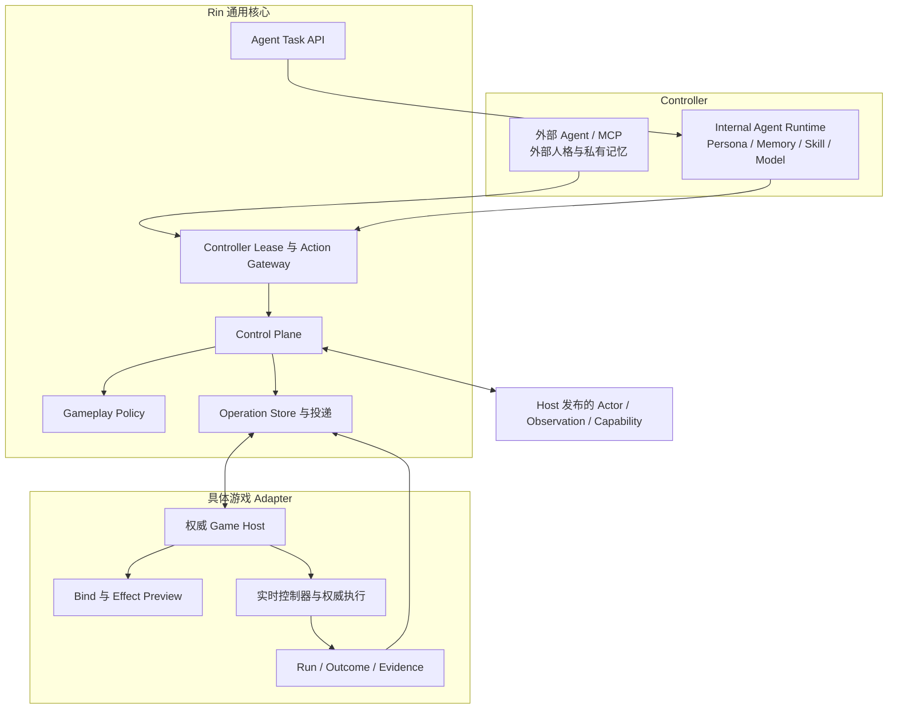
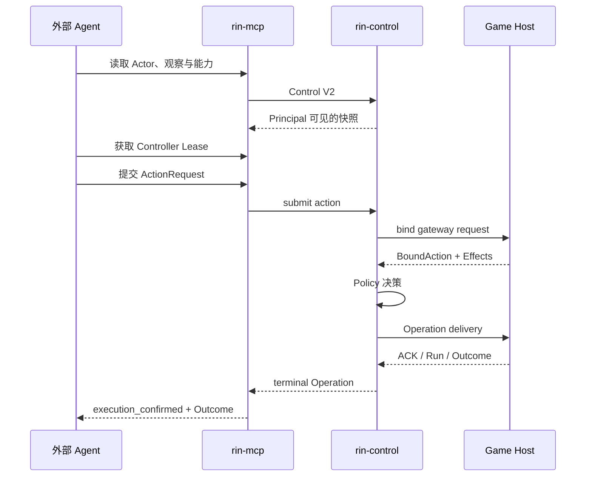

# 架构

[English](architecture.md) | [简体中文](architecture.zh-CN.md)

Rin 是游戏 Agent Harness，不是游戏引擎、NPC 实现或完整 Agent 框架。它负责把
Controller 的语义意图放入一条可约束、可恢复、可审计的执行链；具体游戏继续拥有
对象、规则、线程、实时控制和存档。

## 目标

- 让强模型在 Host 已注册的能力空间内自行选择行动，而不是从少量预制选项中挑选。
- 用代码检查实际 Effect，Prompt 只帮助决策，不能承担权限控制。
- 让内部模型、外部 MCP 和未来 Controller 共用同一条执行链。
- 保持核心引擎无关、轻量且可嵌入测试；Minecraft 只是首个真实 Adapter。
- 把模型决策保持为低频语义控制，把逐帧或逐 Tick 行为留给游戏。

## 总体结构

```mermaid
flowchart TB
    subgraph Controllers["Controller"]
        MCP["外部 Agent / MCP\n外部人格与私有记忆"]
        Agent["Internal Agent Runtime\nPersona / Memory / Skill / Model"]
    end

    MCP --> Gateway["Controller Lease 与 Action Gateway"]
    Agent --> Gateway

    subgraph Rin["Rin 通用核心"]
        Gateway --> Control["Control Plane"]
        Control --> Policy["Gameplay Policy"]
        Control --> Ops["Operation Store 与投递"]
        AgentAPI["Agent Task API"] --> Agent
    end

    Control <--> Catalog["Host 发布的 Actor / Observation / Capability"]
    Ops <--> Host["权威 Game Host"]

    subgraph Adapter["具体游戏 Adapter"]
        Host --> Binder["Bind 与 Effect Preview"]
        Host --> Executor["实时控制器与权威执行"]
        Executor --> Evidence["Run / Outcome / Evidence"]
    end

    Evidence --> Ops
```

## 信任边界

### Controller

Controller 只能表达：要操作哪个 Actor、使用哪个 Capability、参数、已观察到的
不透明目标引用，以及期望的 Epoch/Observation。Controller 不能：

- 创造未发布的能力或目标；
- 声明对象所有权、Effect、风险、可逆性或策略结果；
- 直接访问游戏对象、Java/C#/C++ API、文件、Shell 或控制台；
- 把请求已入队解释为游戏成功。

外部模式使用外部 Agent 的人格和私有记忆。内部模式使用 Rin 配置的 Persona、
Memory 和 Skill。两者只在认知来源上不同，不拥有不同的世界权限。

### Rin core

Rin 信任 Host 发布的结构化身份和 Effect，但不信任模型文字。核心负责：

- Principal、Scope、Host Lease、Controller Lease 与 Emergency Stop；
- Schema、Digest、Epoch、Observation Sequence 和幂等身份检查；
- 确定性的 Effect Policy、确认挑战和预算；
- Operation 状态、投递、取消、重启恢复和对账；
- 内部 Agent 的有界模型上下文、任务、人格、记忆与 Skill Provider。

Rin 不解析游戏引擎对象，也不自行修改游戏世界。

### Game Host

Host 是世界权威。只有 Host 可以：

- 在引擎线程读取真实状态并生成 Observation；
- 解析 `HostRef`，规范化参数并创建 `BoundAction`；
- 根据真实对象生成 Effect Preview；
- 在执行前重新检查游戏规则和 TOCTOU 条件；
- 驱动寻路、战斗、建造等实时控制器；
- 用实际结果产生唯一权威 Outcome。

## 两条认知入口，一条执行链

### 外部 MCP

```mermaid
sequenceDiagram
    participant E as 外部 Agent
    participant M as rin-mcp
    participant C as rin-control
    participant H as Game Host
    E->>M: 读取 Actor、观察与能力
    M->>C: Control V2
    C-->>M: Principal 可见的快照
    E->>M: 获取 Controller Lease
    E->>M: 提交 ActionRequest
    M->>C: submit action
    C->>H: bind gateway request
    H-->>C: BoundAction + Effects
    C->>C: Policy 决策
    C->>H: Operation delivery
    H-->>C: ACK / Run / Outcome
    C-->>M: terminal Operation
    M-->>E: execution_confirmed + Outcome
```

`rin-mcp` 是无状态薄代理。关闭它不会关闭 Daemon 或游戏，多个 MCP Client 也不会
争用监听端口；独占的是 Actor 的 Controller Lease，而不是 MCP 进程。

### Internal Agent

Internal Agent 接收异步 Task，循环执行 `Observe -> Recall -> Decide -> Act -> Verify`。
模型只看到有界摘要，并可进行一次 Capability/Skill 详细检查。模型输出经过封闭
JSON Schema 和允许集合复验，再转换成与 MCP 完全相同的 `ActionRequest`。

内部 Runtime 不因模型返回一句“完成”就认定任务成功；它必须用新 Observation 或
权威 Operation Outcome 验证目标。Provider 故障、控制权变化、预算耗尽和未知结果
会让 Task 暂停或进入明确终态，不会切换到隐藏执行旁路。

## 状态归属

| 状态 | 所有者 | 持久位置 |
| --- | --- | --- |
| 世界、实体、物品、剧情 Canon | 游戏 Host | 游戏自己的存档 |
| Actor Authority 与安全配置 | 游戏 Host | 同一游戏存档 |
| Host/Controller Lease | Control Plane | 运行时投影，重连时重建 |
| Action Operation 与 Outcome | Control Plane | Control 数据目录 |
| 内部 Agent Task 与主观 Memory | Agent Runtime | Control 数据目录下 `agent/` |
| Persona、Skill、Provider 配置 | 管理员 | 私有 Agent 配置文件 |
| 外部 Agent 人格与私有记忆 | 外部 Agent | Rin 不复制 |

V2 当前只承诺同一游戏存档内持续角色，不默认跨存档、跨服务器或跨游戏同步人格与记忆。

## 同步与实时性

模型调用和 MCP 请求不是逐帧控制。推荐频率是：

- Host 周期发布有界 Read Model；
- Controller 在事件、任务阶段或明显状态变化时做一次语义决策；
- Adapter 在游戏线程逐 Tick 执行已经授权的长任务；
- Run 只上报单调、有界进度；Outcome 报告最终可信结果。

这种“低频规划 + 实时本地执行”允许 NPC 自主完成连续工作，同时避免网络延迟直接
阻塞渲染或服务器 Tick。

## 包边界

| 包 | 责任 |
| --- | --- |
| `host` | 引擎中立契约与 Schema 密封 |
| `policy` | Effect 授权、确认、预算和持久 Usage |
| `controlplane` | Host/Controller 生命周期与 Operation |
| `cognition` | Persona、Memory、Skill、模型封装和 Agent Loop |
| `agentapi` / `agentdaemon` | 异步 Task HTTP 与后台调度 |
| `mcpbridge` | MCP Tool 到 Control V2 的映射 |
| `sdk/hostkit` | Adapter Authority Dispatch 辅助 |
| `examples/adapters` | 不被核心导入的验证实现 |

架构测试会拒绝核心包导入游戏示例、Adapter、Mod、Minecraft 或 Fabric 类型。

## 故障模型

- Host 断线前未领取的 Operation 最终变为 `stale`。
- Host 已接受但结果尚未对账的 Operation 可以恢复投递或进入
  `outcome-unknown`，不能猜测结果。
- Controller Lease、Authority Revision 或 Epoch 变化会隔离旧意图。
- Emergency Stop 阻止新动作，并向未完成 Operation 发出取消请求。
- 单个数据目录只允许一个写进程；不支持共享文件系统上的多实例写入。

详细语义见 [Operation 与策略](operations.zh-CN.md)和
[Host V2 契约](host-contract.zh-CN.md)。
