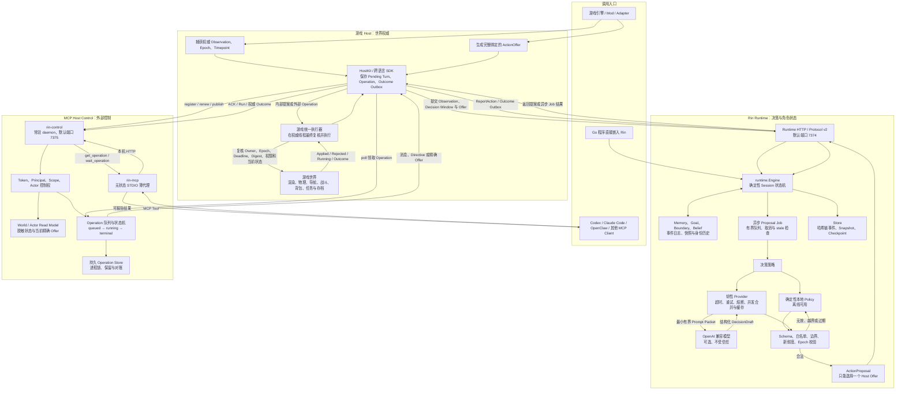

# Rin 总体流程图

本文用一张图说明 Rin 运行时决策、模型调用、Host 执行以及 MCP 外部控制如何协作。
Rin 是引擎无关的控制层，游戏 Host 始终是世界状态和世界修改的唯一权威。

## 读图顺序

1. 游戏 Host 捕获可信观察，并生成已经绑定参数、目标、Epoch 和截止时间的 Offer。
2. 内部决策走 Runtime：Rin 从本地策略或在线模型取得草案，再由本地验证器生成提案。
3. 外部决策走 Host Control：Agent 通过 `rin-mcp` 读取状态或选择 Host 已发布的完整 Offer。
4. 两条路径最终都回到游戏 Host 的同一个执行器；Rin 和 MCP 都不能直接修改游戏世界。
5. Host 在权威线程重新检查世界状态并执行，然后分别向 Runtime 或 Control Plane 回报结果。
6. 只有带 Host 权威 Outcome 的终态 Operation 才能证明动作已经执行成功。

## 关键边界

- **世界权威在游戏侧**：Rin 不实现引擎对象、逐帧移动、导航、物理、战斗或任意脚本执行。
- **模型只做有界选择**：模型不能增加坐标、参数、Capability 或未被 Host 提供的动作。
- **两个服务彼此独立**：`rin` Runtime 管理角色状态与决策；`rin-control` 管理外部控制与投递。
- **MCP 代理无状态**：多个 Client 可以各自运行 `rin-mcp`，退出代理不会关闭 daemon。
- **持久化责任分层**：Rin 保存角色事件与快照；Host 保存 Pending Turn、效果标记和 Outcome Outbox。
- **失败时关闭权限**：过期 Epoch、失效 Offer、控制权修订变化、未知字段和权限不足都会被拒绝。
