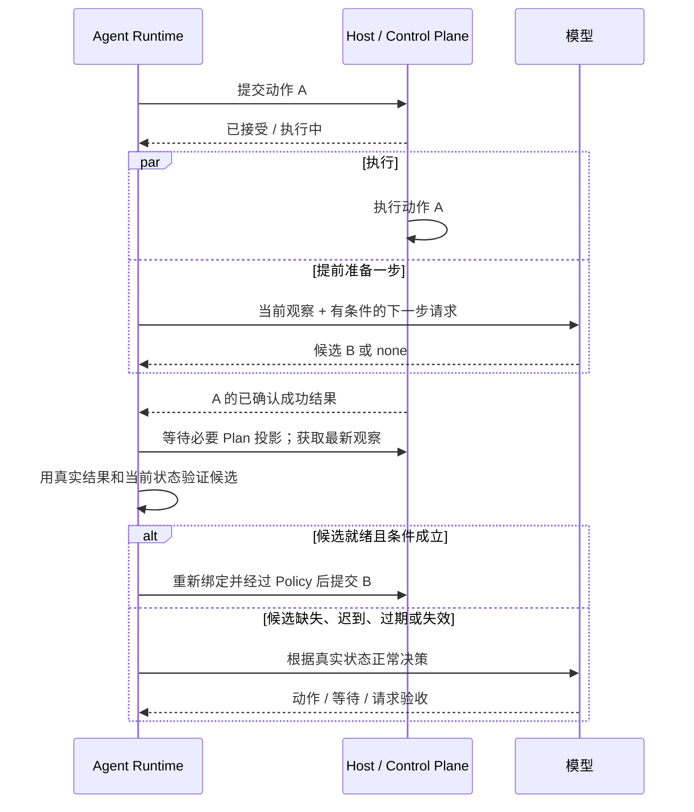

# 执行过程中提前规划

[English](lookahead.md) | [简体中文](lookahead.zh-CN.md)

内部 Agent 可以在普通 Operation 已接受或执行中时，提前准备一个有条件的后继动作。
内置 `StructuredDecisionProvider` 默认支持。Host 继续执行当前动作，只有正常执行
循环才能在验证后采用并提交候选。



例如角色正在走向一棵树，模型可以提前准备采集这棵已观察到的树。提交前仍需确认已抵达、
必要事实成立、目标仍在且能力有效。如果下一步依赖尚未返回的输出，或者新生成且尚未
观察到的目标，就留到真实结果返回后正常决策。

## 候选的能力边界

`LookaheadProvider` 是 `ModelProvider` 的可选扩展：先在不访问网络的情况下给出
Token 预留量，再进行一次有条件的模型请求。`NextStepDraft` 只能携带一个普通能力、
参数、已观察目标的句柄、已有 Plan 步骤，以及最多 8 个标量 Host 事实前置条件。
预期值可以描述动作成功后的状态，但 Fact ID 必须已经由 Host 发布；`none` 表示
本轮不预测后继动作。

这个模型契约不能完成任务、改写 Plan、写记忆、声明执行结果或构造已绑定动作。
有界上下文额外附带最多 4 个普通能力的完整 Schema；预规划没有追加检查轮次。
Macro 激活继续使用已有流程；运行中 Macro 的普通子动作可以提前准备下一个普通子动作。

A 成功后，正常循环先等待必要的 `task-plan` 结果投影确认，再获取最新观察，并核对：

- 任务、目标、Controller Lease、Epoch、注意状态和 Plan 意图仍然匹配。
- 紧邻的前一个 Operation 有 Host 已确认的成功结果。
- 当前观察不早于该结果，也不早于预规划使用的观察。
- 实际活动 Plan 步骤、Capability Digest、事实预期值及其 Host Subject 均匹配。
- 原始 Host 目标引用仍在最新观察中，参数仍符合能力 Schema。

A 完成引起的 Observation Sequence、Plan revision 和阶段推进属于正常变化。
Plan 意图被改写时，即使复用同一个 Step ID，候选仍会失效。目标句柄从最新观察重新
解析，提交继续经过 Host Binding、Policy、必要确认及已有动作意图持久化流程。
任务完成仍遵循调用方的验收策略。

## 配置与成本

可以在已有 Agent JSON 配置中加入以下可选部分：

```json
{
  "runtime": {
    "lookahead": {
      "disabled": false,
      "max_concurrent": 2,
      "timeout_millis": 10000,
      "draft_ttl_millis": 60000
    }
  }
}
```

以上就是默认值。每个 Runtime 的后台并发数范围为 1–32；超时范围为 100–60000 ms。
TTL 从创建后台工作时起算，不得短于超时，最长 300000 ms。Runtime 最多保留 256 项
后台工作，包含已完成但等待执行边界的候选；并发池忙时跳过，不额外排队请求模型。

Console 的 Agent 配置提供“执行时提前准备下一步”开关。保存后按已有配置流程重启
Daemon 生效。Management API 提供高级限制，切换开关会保留这些值。未实现
`LookaheadProvider` 的 Provider 保持串行；自定义 Provider 必须支持并发调用并响应
Context 取消。

每个 Operation 最多开始一次预规划。请求模型前，Task 持久化增加 `model_calls` 并
预留 Token；只有至少剩余 2 次模型调用、2 倍预留用量时才启动，为正常回退保留空间。
内置估算使用已准备提示的 UTF-8 字节数、Schema 开销和输出额度，预规划输出最多
2048 Token。这是 Runtime 的保守估算，不是供应商计费上限。

供应商返回有效用量时替换预留值，输出非法但用量已知的响应也会计费。缺少或非法用量
保留预留扣账；报告总量与输入加输出之和取较大值。超预算的已知用量仍会保存，让正在
执行的 Operation 正常结算，同时阻止后续模型决策。网络重试沿用供应商原有恢复配置；
`model_calls` 统计逻辑调用次数，不是 HTTP 尝试次数。

## 取消、恢复与观察

上下文准备和模型推理不占用任务执行锁或调度 worker。取消、暂停、任务权限变化或新
注意信号会使候选失效，不等待模型退出。预规划超时或失败不会暂停当前动作。到达下一
决策边界时，尚未完成的候选会被取消，直接开始正常决策；迟到结果可以结算用量，但
不能替换已经作出的决策。

候选只保存在进程内。重启后丢弃候选，将尚未结算的持久化预留保守扣账一次，继续跟踪
原 Operation，避免重复提交。Task 投影升级为 `rin.cognition.tasks/v6`，仍支持导入
v3/v4/v5。自行嵌入 Runtime 时，必须先调用 `AgentRuntime.Close()`，再关闭 Task、
Memory 和 Plan Store；Daemon 已负责这一步。

Task API 和 Console 展示 `preparing`、`running`、`ready`、`adopted`、`discarded`，
以及调用、采用、未采用次数和未结算的 Token 预留。时间线记录 `lookahead.*` 事件、
废弃原因、实测供应商延迟及可用用量。`ready` 仍需等待执行条件核验；采用次数只表示
复用了候选，不代表任务已经完成。

并发回归测试在保持 A 执行中的同时准备 B，并覆盖重新绑定、Plan 投影确认与改写、
事实/目标/Epoch 变化、超时、取消、并发池占满及 SQLite 重启恢复，验证执行与规划
确实重叠。实际节省时间取决于 Host 动作时长、模型延迟和采用率，没有预设生产加速比例。
