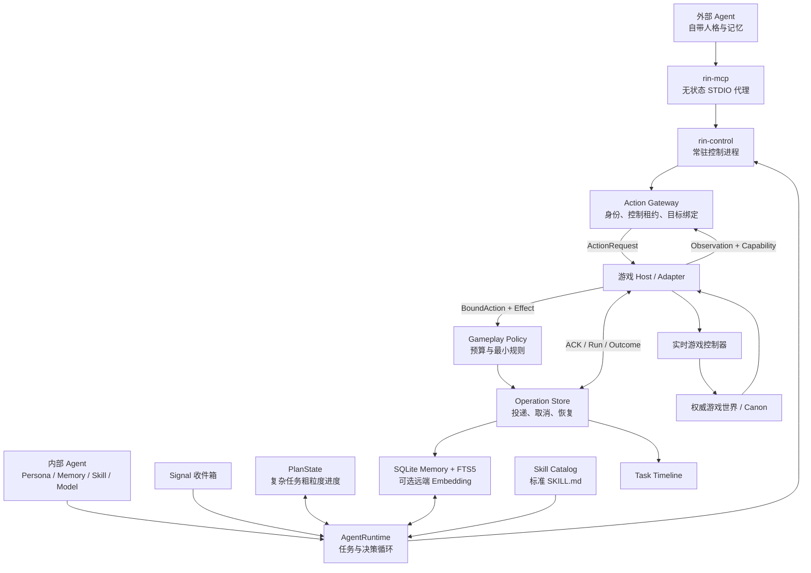

# 里程碑 A 验收报告

[简体中文](milestone-a-validation.zh-CN.md) | [English](milestone-a-validation.md)

日期：2026-08-17  
状态：自动实现与回归完成，等待真人验收  
范围：Rin、rin-mi、ai-galgame

## 结论

Rin 已形成一套不依赖具体游戏的执行 Harness。内部 Agent 与外部 MCP Agent 使用不同的
人格和推理入口，但最终共用同一套 Controller Lease、Action Gateway、Gameplay Policy、
Operation 和 Host Outcome。Minecraft 与视觉小说已作为两个真实 Adapter 走通这条链路。

自动门禁全部通过，但里程碑 A 尚未完成。锁屏环境无法替代真实 GUI、TTS 听感、角色自然度、
复杂地形连续操作和 Windows 实机启动，因此当前必须停在真人验收门。外挂记忆 Provider、Mem0、
Hindsight 和 Graphiti 均未开始。

## 当前架构

关键边界：

- 游戏世界与剧情 Canon 由 Adapter 持有；Rin Memory 只是可检索投影。
- 模型选择目标和能力，但 Host 绑定实际对象与 Effect，Policy 决定是否允许。
- `queued`、`accepted` 和 `running` 都不等于成功；只有 Host Outcome 可令
  `execution_confirmed=true`。
- 简单动作直接进入 Gateway；复杂任务才使用 PlanState，且不会每一步重新调用 Planner。
- 外部 MCP 不依赖内部模型；内部 Agent 不会在外部 Controller 持有控制权时抢占角色。

## 运行时拆分

Rin 的 `AgentRuntime` 从约 1896 行降至 774 行，职责分别位于：

- `context_assembly.go`：Persona、Memory、Skill 与 Observation 上下文装配。
- `task_lifecycle.go`：任务创建、恢复、暂停和终态。
- `plan_decision.go`：PlanDraft、模型决策和确定性重规划。
- `action_operation.go`：动作提交、Operation 等待、Outcome 与下一轮协调。
- `signal_scheduler.go`：只在内部主动模式下消费 Signal 并唤醒任务。

rin-mi 的 `CompanionRuntime` 从约 4182 行降至 3892 行，提取了动作分派、能力投影、主动调度、
Operation 恢复和伙伴会话存储。组件保持包内可见，没有把 Minecraft 类型放进 Rin Core。

## 自动验收证据

| 范围 | 结果 |
| --- | --- |
| Rin Core | `make verify` 通过：契约、Vet、Race、Go 全仓测试 |
| SDK | Python、JavaScript、C#、Java、Lua 测试通过 |
| 示例 Adapter | Grid、Story、Terminal 测试通过 |
| 构建 | macOS arm64、Windows amd64、Linux amd64 可执行文件生成成功 |
| rin-mi | Core、安装器、17/17 Fabric GameTest 通过 |
| rin-mi 跨进程 | 真实 `rin-control` 下 V2 Binding 与 Internal Agent Macro 通过 |
| ai-galgame | 328 个 Python 测试、Ren'Py Lint、内容与资源检查通过 |
| ai-galgame 跨进程 | External 与 Internal 两条真实进程 E2E 通过 |

ai-galgame 内容烟测覆盖 7 章、19 个交互回合、12 个桥接、13 个章节收束、7 段核心对话、
6 个安静时刻和约 150 分钟规划内容。Lint 统计为 285 个对白块、18 个菜单、27 个图像和
30 个 Screen。

## 性能与 Token

以下数据来自本机自动回归，只用于发现版本回退，不是跨机器性能承诺：

| 项目 | P50 | P95 | 门限 |
| --- | ---: | ---: | ---: |
| SQLite Memory 检索 | 8.58ms | 9.59ms | P95 < 250ms |
| PlanState 操作 | 0.14ms | 0.23ms | P95 < 100ms |

脚本模型 Fixture 每次请求报告 100 Prompt、40 Completion、64 Cache Hit、36 Cache Miss Token。
该数据证明字段从 Provider 传播到 Timeline，不能代表真实供应商的缓存节省。真实收益必须在
配置实际模型后，比较同类任务的命中 Token、首 Token 延迟和总费用。

## 破坏性清理

按照“不保留旧版本兼容性”的决定，Rin 已删除文件记忆后端、对应测试和 `memory.json` 首次
迁移入口。`memory.db` 是 Rin Memory 域唯一在线存储，JSONL 只用于显式导入导出。没有保留
新旧双路执行。

## 仍需真人验收

1. 连续使用 2 至 4 小时：Minecraft 至少 90 分钟，内部与外部控制各至少 45 分钟；视觉小说
   至少 45 分钟。
2. Minecraft 覆盖采集、制作、建造、生存、战斗、重规划、暂停恢复、控制权切换、急停和重启；
   特别检查复杂地形、客户端追击和外部批量建造。
3. 视觉小说覆盖固定剧情、AI ScenePacket、关键选择、主动话题、Canon 冲突、存读档、回滚和
   Internal/External 切换，并判断对白是否自然。
4. 解锁桌面后运行 Ren'Py 原生 Testcase，检查 1280x720、1536x864、1920x1080 UI；在真实
   Windows 环境启动发布包。
5. 真人试听不同角色 TTS，确认日语读音、停顿、音色绑定和无声降级；审阅剧情与美术。
6. 人工对照 Timeline，确认公开理由、Memory/Skill Ref、Token、Policy 与 Outcome 能解释实际
   游玩，且没有泄露 Prompt、私有记忆或凭据。

## 已知限制

- GameTest 启动时可能出现缺省 `server.properties`、Yggdrasil 网络超时和上游弃用警告；测试
  服务仍正常运行，17 个必需用例通过。
- macOS 锁屏时 Ren'Py 无可用 Display，原生窗口测试没有被标记为通过。
- 交叉编译只证明可生成 Windows/Linux 二进制，不替代目标系统运行。
- 自动轨迹证明协议与终态一致，不证明角色“像活人”的主观体验。

## 阶段提交

Rin：`ded4d23`、`6ed7da6`、`def23b7`、`07a8c8b`、`5cb2562`、`ff8cdb8`。  
rin-mi：`0e37394`、`e2f8e48`、`d656ca6`、`70a56e1`、`4026468`。

真人验收完成并由用户确认前，不开始 ExternalMemoryProvider SPI 或任何具体外挂记忆适配器。
