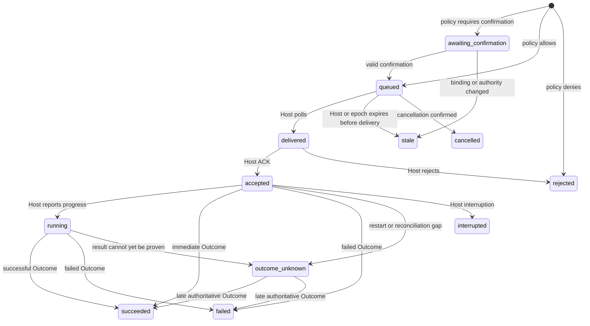

# Operations and gameplay policy

[English](operations.md) | [简体中文](operations.zh-CN.md)

The Control Plane turns an `ActionRequest` into a durable, waitable,
cancellable, reconcilable operation. Gameplay policy evaluates actual effects
bound by the Host before an operation may enter the execution queue.

## Sole mutation gateway

`SubmitAction` is the only V2 controller mutation gateway:

1. validate principal, scope, Actor visibility, and exclusive controller lease;
2. validate epoch, observation sequence, capability digest, and idempotent identity;
3. ask the Host to create a `BoundAction` and effect preview on its authority thread;
4. recheck authority revision, lease, epoch, and observation after binding;
5. evaluate every effect with gameplay policy;
6. persist the operation before a Host may collect it.

Internal Agents, MCP, and language SDKs all reach this gateway. A game command
or UI triggering the same autonomous behavior should use the same adapter
execution service instead of maintaining a second permission system.

## Policy

Policy is deterministic and never calls a model or network. It matches only
standard Host-authored effect fields and trusted context, not model rationale
or arbitrary prose in adapter attributes.

### Safety kernel

Configuration cannot override denial of:

- arbitrary code, file access, native calls, authority forgery, or secret exposure;
- unregistered effect kinds or scopes;
- `ownership=unknown`;
- invalid profile, epoch, or principal.

### Profiles

| Profile | Default behavior |
| --- | --- |
| `guarded` | allow low-risk reads, communication, and reversible owned actions; deny high risk; confirm the rest |
| `survival` | allow known ordinary survival effects; confirm player/shared/system assets and high risk; deny critical |
| `open` | allow known non-critical effects; still confirm critical risk |
| `privileged-custom` | refine the same open-profile kernel with explicit rules and budgets |

A profile supplies defaults. Rules at server, world, owner, actor, and task
layers match kind, operation, ownership, scope, tags, risk, and reversibility to
allow, deny, or require confirmation. Priority conflicts resolve deterministically.

### Budgets

Budgets at the same layers limit action count and quantity, optionally in a
Host-clock window. An allow decision reserves budget first; usage commits only
after the Host accepts execution. Rejection or persistence failure releases the
reservation. Policy state persists usage and pending reservations but never a
reusable confirmation.

## Confirmation

`require_confirmation` creates a single-use challenge bound to:

- controller, Actor, and principal;
- effect digest, policy revision, and epoch;
- a Host-clock expiration.

Confirmation does not rebind or silently alter the original action. The
Control Plane asks the Host for a fresh snapshot, rechecks epoch, observation,
lease, and emergency stop, consumes the challenge, and reevaluates the same
`BoundAction`. A changed condition makes the operation stale or requires a new
confirmation.

## State machine

Terminal states also include `cancelled`, `interrupted`, `stale`, and
`rejected`. State moves forward only; a late or decreasing `progress_seq` is
rejected.

## Execution proof

An operation view explicitly exposes:

- `terminal`: whether the state is stable and final;
- `execution_confirmed`: whether an authoritative successful Host outcome exists;
- `reconciliation_pending`: whether Host reconciliation is still expected;
- `delivery_attempts`: how many times a Host actually collected the request;
- `run`, `outcome`, `output`, and rejection details.

A caller may tell a player that execution completed only when
`status=succeeded`, a valid Host outcome exists, and
`execution_confirmed=true`.

`queued` means durably enqueued, `accepted` means Host acceptance, `running`
means in progress, and `changed=false` means only that a long poll observed no
new version. `stale` with `delivery_attempts=0` proves the Host never collected
the request.

## Idempotency and waiting

An identical action under the same principal and `idempotency_key` returns the
same operation. Reusing the key with another payload conflicts. After a network
timeout, query or exactly retry the original identity; do not resend under a
new key.

`wait_operation` uses an opaque cursor and waits at most 25 seconds per call.
Copy the cursor without parsing it. A wait timeout does not cancel the operation.

## Host delivery and recovery

A leased Host long-polls the daemon:

1. `poll` receives binding gateways, operations, and cancellation requests;
2. return a binding or snapshot idempotently by gateway ID;
3. acknowledge an operation ID idempotently;
4. optionally report a Run;
5. publish the sole Outcome from game results and a durable outbox.

If the Host disconnects before ACK, a request whose binding can no longer be
proven becomes `stale`. After ACK, the same operation may be redelivered and the
adapter must deduplicate according to its durability profile. Evidence of
execution without a result enters `outcome-unknown`, allowing a later
authoritative outcome.

Control state uses a single-writer lock and atomic file replacement. The Host
republishes its read model and lease after reconnect; persisted operation
identities and terminal outcomes do not change across daemon restart.

## Cancellation and emergency stop

Cancellation requests a stop and cannot undo effects that already happened.
A capability declares unsupported, cooperative, or preemptive cancellation;
the Host reports the actual final state.

Emergency stop is an Actor-level, owner-controlled safety latch:

- it blocks new actions from internal and external sources;
- it requests cancellation for all unfinished operations;
- it does not restore already changed world state;
- clearing it still requires a valid controller lease and fresh observation.

## Macros

A macro is a capability that may create child operations, not an arbitrary plan
script. Its parent must be Host-accepted or running, and parent plus child share
the Actor, controller lease, principal, and a non-empty `task_id`. Every child
still receives independent binding, policy, operation, and outcome checks, with
a maximum of 1,024 children.

This lets a model compose collection, movement, crafting, and building work
while preserving per-step authorization, budgets, cancellation, and diagnosis.
