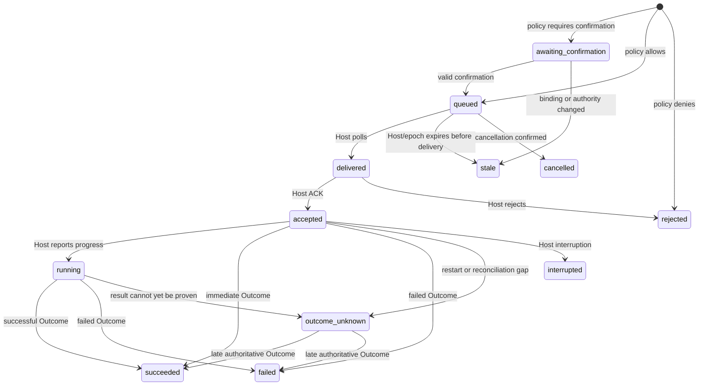

# Operation 与 Gameplay Policy

[English](operations.md) | [简体中文](operations.zh-CN.md)

Control Plane 把一次 `ActionRequest` 变成可持久、可等待、可取消和可对账的
Operation。Gameplay Policy 在 Operation 入队前检查 Host 绑定出的实际 Effect。

## 唯一修改入口

`SubmitAction` 是 V2 唯一的 Controller 世界修改入口：

1. 校验 Principal、Scope、Actor 可见性和独占 Controller Lease；
2. 校验 Request 的 Epoch、Observation Sequence、Capability Digest 和幂等身份；
3. 请求 Host 在权威线程生成 `BoundAction` 与 Effect Preview；
4. 再次确认 Authority Revision、Lease、Epoch 和 Observation 未变化；
5. 用 Gameplay Policy 评估所有 Effect；
6. 持久化 Operation 后才允许 Host 领取。

内部 Agent、MCP 和语言 SDK 最终都调用这条入口。游戏命令或 UI 若要触发同类自主
行动，也应进入相同的 Adapter 执行服务，不能维护第二套权限语义。

## Policy

Policy 是确定性的，不调用模型或网络。它只匹配 Host 编写的标准 Effect 字段和
可信 Context，不读取模型理由或 Adapter Attributes 中的任意文字。

### 安全内核

以下情况始终拒绝，配置不能覆盖：

- arbitrary code、file access、native call、authority forgery、secret exposure；
- 未注册的 Effect Kind 或 Scope；
- `ownership=unknown`；
- 无效 Profile、Epoch 或 Principal。

### Profile

| Profile | 默认行为 |
| --- | --- |
| `guarded` | 允许低风险读取、交流和可逆自有操作；高风险拒绝；其余要求确认 |
| `survival` | 允许已知普通生存 Effect；玩家/共享/系统资产或高风险要求确认；critical 拒绝 |
| `open` | 允许已知非 critical Effect；critical 仍要求确认 |
| `privileged-custom` | 与 open 相同的内核下，由显式 Rule 和 Budget 细化 |

Profile 只提供默认值。Rule 可在 server、world、owner、actor、task 五层按 Kind、
Operation、Ownership、Scope、Tag、Risk 和 Reversible 匹配 allow、deny 或
require_confirmation。优先级冲突必须得到确定结果。

### Budget

Budget 按相同层级限制动作数和数量，并可绑定 Host Clock Window。Allow 决策先保留
Budget；只有 Host 接受并实际进入执行链后才提交 Usage，拒绝或持久化失败会释放。
Policy State 保存 Usage 与未完成 Reservation，但不保存可重用确认。

## 确认

`require_confirmation` 生成单次 Challenge，绑定：

- Controller、Actor、Principal；
- Effect Digest、Policy Revision 和 Epoch；
- Host Clock 到期时间。

确认时不会重新绑定或悄悄修改原 Action。Control Plane 先向 Host 获取新 Snapshot，
确认 Epoch、Observation、Lease 和急停均未变化，再消费 Challenge 并重新评估同一个
`BoundAction`。任一条件变化都会变为 `stale` 或再次要求确认。

## 状态机

实际终态还包括 `cancelled`、`interrupted`、`stale` 和 `rejected`。状态转换只能前进；
`progress_seq` 必须单调，迟到或倒退的 Run 被拒绝。

## 执行证明

Operation View 显式包含：

- `terminal`：是否已经稳定终止；
- `execution_confirmed`：是否存在 Host 权威成功 Outcome；
- `reconciliation_pending`：是否仍等待 Host 对账；
- `delivery_attempts`：Host 实际领取次数；
- `run`、`outcome`、`output` 和拒绝原因。

只有 `status=succeeded`、存在合法 Host Outcome 且
`execution_confirmed=true` 才能向玩家报告行动已经完成。

`queued` 仅表示已耐久入队；`accepted` 仅表示 Host 接受；`running` 仅表示执行中；
`changed=false` 仅表示长轮询期间没有新版本。`stale` 且
`delivery_attempts=0` 明确表示 Host 从未领取请求。

## 持久化结果投递

Host 结果与各订阅者的投递状态一起提交到 `operations.db`；变更的 Operation 行与
Policy、Controller 检查点在同一 SQLite FULL 同步事务中落盘。Host 回复只等待这次落盘，
计划和记忆回写由后台处理。`Options.OutcomeSinks` 按稳定 ID 注册独立 worker，应用使用
`task-plan` 和 `memory`；旧 `OutcomeSink` 仍可作为 `default` 订阅者使用。

各订阅者分别确认。回写失败、panic 或确认落盘失败都会保留待投递状态，同一 Operation
对同一订阅者最多每秒重试一次，每次尝试传入 5 秒超时 Context，重启后继续重放。这是
**至少一次投递**：订阅者必须按 Operation ID 幂等处理，并响应 Context 取消。某个订阅者
缓慢不会阻塞其他订阅者；带 Plan 的任务会等待计划结果投影确认后再推进。

未全部确认的 Operation 不受普通保留期清理，但仍计入容量上限。因此长期回写故障可能
阻止新提交，不会静默丢弃未确认结果。跨重启应保持订阅者 ID 稳定：移除订阅者会保留其
待处理结果，恢复相同 ID 后继续；新增 ID 会重放仍被保留的结果。持久化服务每个 Operation
最多支持 64 个有效订阅者 ID，包含历史注册 ID；旧 OutcomeSink 不能与具名订阅者重复占用
`default`。

SQLite Schema 1 保存 `rin.control.operations/v6` 表示。首次创建数据库时导入已有
v5、v6 `operations.json`；v5 没有投递确认记录，会把仍保留的结果重放给已配置订阅者。
后续打开不再导入旧 JSON 备份，详见[存储迁移](execution-storage.zh-CN.md)。关闭时先停止
Control Plane，再关闭订阅者使用的存储。

## 幂等与等待

同一 Principal 和 `idempotency_key` 的完全相同 Action 返回同一 Operation。相同
Key 配不同 Payload 会冲突。网络超时后应查询或精确重试原身份，不能换 Key 重发。

`wait_operation` 使用不透明 Cursor，单次最长等待 25 秒。客户端复制 Cursor 即可，
不应解析其格式。超时不会取消 Operation。

## Host 投递与恢复

Host 通过 Lease 长轮询：

1. `poll` 收到 Binding Gateway、Operation 或取消请求；
2. 用 Gateway ID 幂等返回 Binding/Snapshot；
3. 对 Operation ID 幂等 `ack`；
4. 可选上报 `run`；
5. 从游戏结果和持久 Outbox 上报唯一 `outcome`。

Host 在 ACK 前断线时，无法证明绑定仍适用的请求会变为 `stale`。ACK 后断线时，
同一 Operation 可以重投；Adapter 必须按其 Durability Profile 去重。已经看到执行
迹象但缺少结果时进入 `outcome-unknown`，允许 Host 后续提交权威 Outcome。

Control 状态使用单写者锁和原子文件替换。Host Read Model 与 Lease 由 Host 重连后
重新发布；Operation 身份和已持久终态不会因 Daemon 重启而改变。

## 取消与急停

取消只请求停止，不能撤销已经发生的 Effect。Capability 声明 unsupported、
cooperative 或 preemptive 取消语义；最终状态由 Host 报告。

Emergency Stop 是 Actor 级、Owner 控制的持久安全闩：

- 阻止内部和外部来源提交新动作；
- 请求取消所有未完成 Operation；
- 不自动恢复已执行世界修改；
- 解除后仍需重新获取有效 Controller Lease 和新 Observation。

## Macro

Macro 是可产生子 Operation 的 Capability，不是任意计划脚本。Parent 必须已经被 Host
接受或运行，父子共享 Actor、Controller Lease、Principal 和非空 `task_id`。每个
Child 仍独立执行 Binding、Policy、Operation 和 Outcome，最多 1024 个子 Operation。

这样模型可以组合采集、移动、合成和建造等连续任务，同时保留逐步授权、预算、取消
和故障定位。
